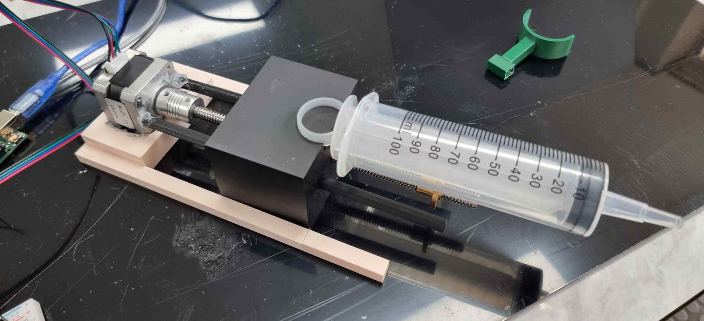
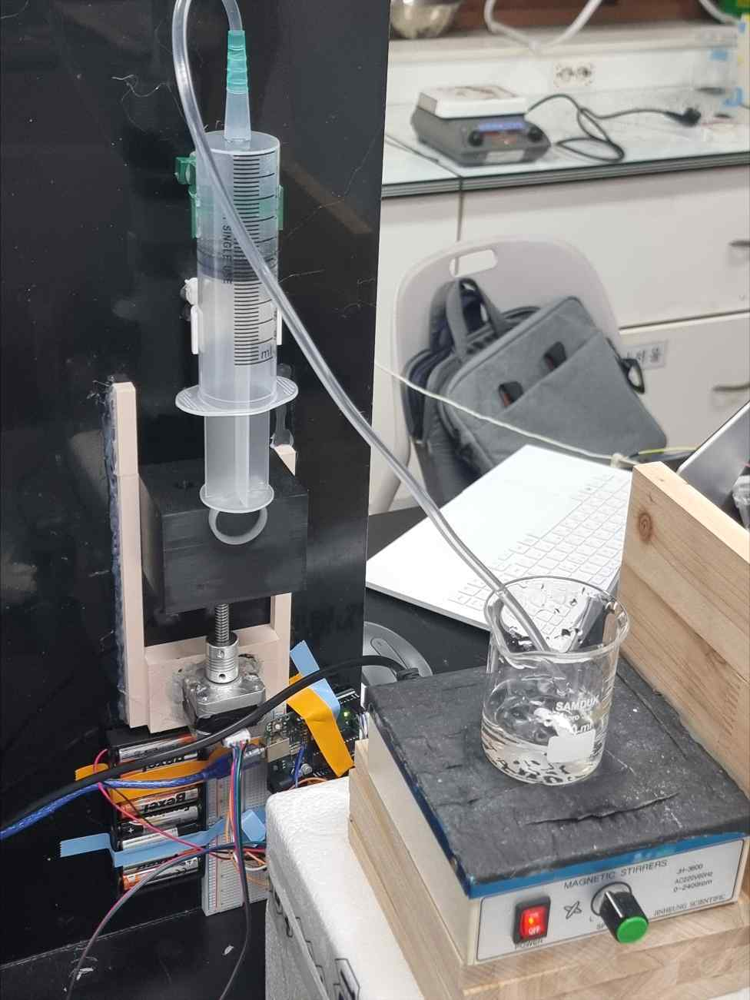
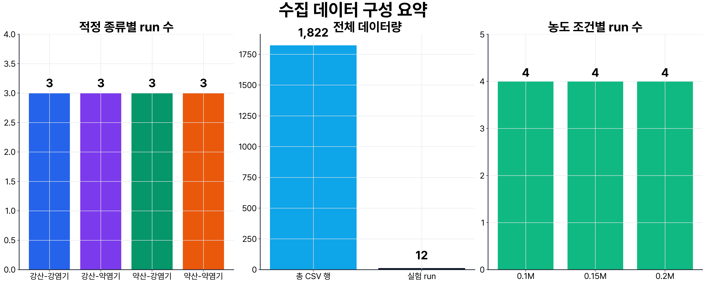
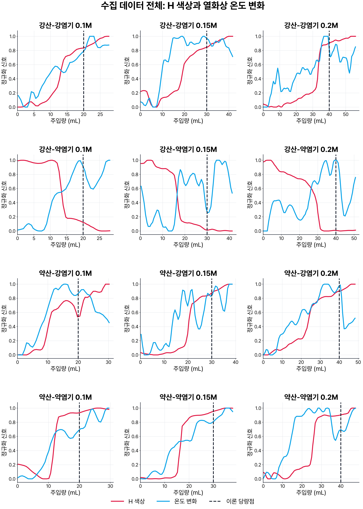
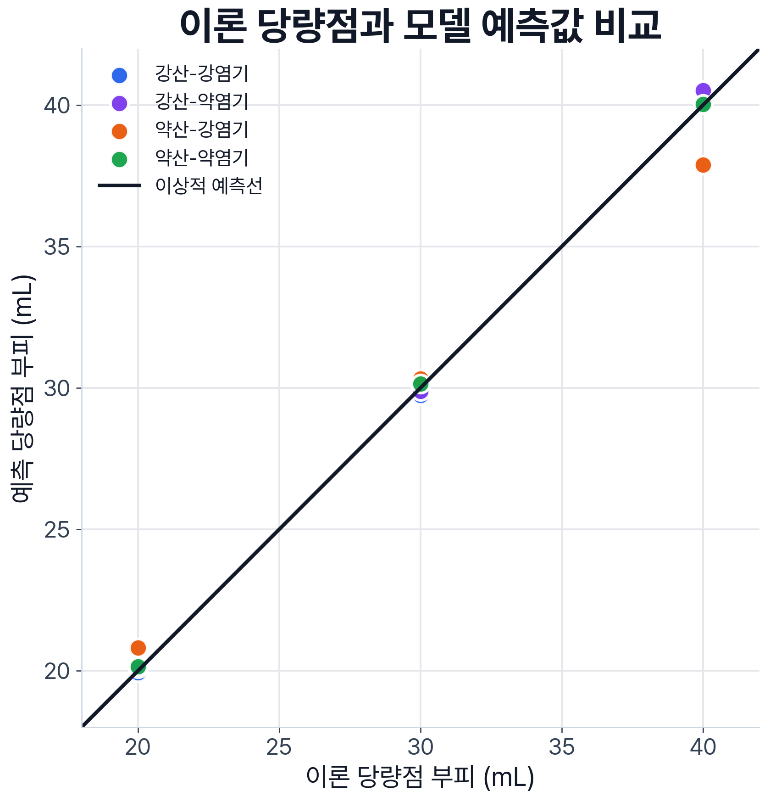
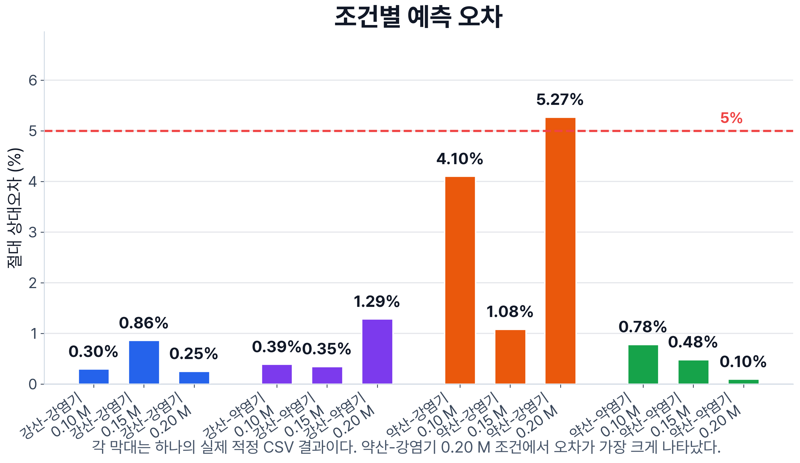

# 색 변화·열화상·주입량 융합 기반 자동 적정 보조 시스템 개발

<!--
전국대회 제출용 개정 원고.
HWPX 편집 시 이 주석은 삭제하고, [그림 삽입] 표시는 실제 사진과 화면으로 교체한다.
지역대회 제출 원고는 연구 이력 보존을 위해 별도 파일로 유지한다.
-->

## 연구 요약

산·염기 적정에서는 지시약의 색이 변한 순간에 실험자가 직접 주입을 멈춘다. 종말점 부근의 색 변화가 짧거나 완만하면 관찰자에 따라 정지 시점이 달라질 수 있고, 실험이 끝난 뒤에는 당시의 색, 온도, 주입량을 다시 확인하기 어렵다. 본 연구에서는 이 문제를 줄이기 위해 일반 카메라의 색 변화, HIKMICRO Mini2 열화상 카메라로 관찰한 용액·용기 영역의 겉보기 표면온도 변화, 시린지 펌프의 계산 주입량을 같은 시간축에 기록하는 자동 적정 보조 시스템을 제작하였다.

스테퍼 모터와 T8 리드스크류를 이용해 100 mL 주사기를 구동하는 펌프를 만들고, 이를 일반 카메라·Mini2·화학 계산·CSV 저장 기능이 통합된 Windows 대시보드와 연결하였다. 실제 적정에서는 강산-강염기, 강산-약염기, 약산-강염기, 약산-약염기의 네 적정 종류를 0.10 M, 0.15 M, 0.20 M 시료 농도에서 각 1회씩 수행하였다. 시료 부피는 20.0 mL, 적정액의 명목 농도는 0.10 M였으며, 총 12개 실험 CSV에 1,822개의 시간축 행을 기록하였다.

수집 자료를 이용한 초기 곡선 후보 회귀 분석의 MAE는 2.306 mL, RMSE는 3.012 mL, MAPE는 8.81%였다. 이후 현재 주입량과 색·열화상 특징을 이용해 프레임이 이론 당량점 주변 구간에 속하는지를 분류하고, 적정 종류별로 모델과 집계 방식을 선택하였다. 같은 12개 개발 실험에서 선택한 결과는 MAE 0.392 mL, RMSE 0.685 mL, MAPE 1.27%였다. 그러나 모델 선택과 평가에 같은 소규모 자료를 사용했고, 독립적으로 측정한 실제 당량점 참값도 없으므로 1.27%는 새로운 실험에 대한 일반화 성능이 아니라 개발 데이터에서 얻은 탐색 결과이다.

12개 습식 실험은 사람이 펌프를 정지하는 방식으로 수행하였다. 이후 Windows 앱에 사용자가 직접 선택해야 활성화되는 기본 꺼짐 상태의 자동정지 소프트웨어를 추가하였다. 이 기능은 일반 카메라 ROI의 초기색을 보정한 뒤, 실시간 구간 분류기 점수가 기준을 넘으면서 시작된 지시약 색 변화가 일정 시간 지속될 때 정지 명령을 전송한다. 명목 이론 당량점은 정지 조건으로 사용하지 않는다. 단위시험과 통합시험은 수행했지만, 실제 산·염기 실험에서의 정지 부피·지연·과주입량은 본 연구 결과로 검증하지 않았다.

본 연구가 직접 입증한 핵심은 상용 자동적정기 수준의 정확도가 아니다. 학생이 제작한 장치에서 색·열화상·주입량을 실제 적정 중 동기화하고, 실험 뒤 다시 분석할 수 있는 자료로 저장했으며, 그 자료를 당량점 후보 추정과 후속 제어 연구로 연결했다는 데 의미가 있다.

---

## Ⅰ. 탐구 동기 및 목적

### 1. 연구 동기

적정에서 화학량론적으로 반응이 완료되는 지점은 당량점이고, 실험자가 지시약의 색 변화로 관찰하는 지점은 종말점이다. 두 지점은 지시약의 변색 범위, 용액의 실제 농도, 혼합 상태와 관찰 시점에 따라 달라질 수 있다. 특히 종말점 부근에서 주입을 멈추는 판단은 짧은 시간 안에 이루어지므로, 사람이 본 장면과 주입량을 나중에 다시 확인할 수 있는 기록이 필요하다고 생각하였다.

이 연구의 착상에는 자격루의 계량 방식도 영향을 주었다. 자격루의 구조를 재현한 것은 아니지만, 일정한 흐름을 시간과 연결하고 특정 시점의 사건을 기록한다는 개념을 적정에 적용하였다. 시린지 펌프가 비교적 일정한 속도로 움직이면 작동 시간은 주입량 추정치로 바뀐다. 여기에 같은 시점의 색과 열화상 값을 붙이면, 어느 부피에서 어떤 변화가 나타났는지 사후에 검토할 수 있다.

### 2. 연구 목적

본 연구의 목적은 다음과 같다.

1. 직접 제작한 시린지 펌프와 일반·열화상 카메라를 실제 산·염기 적정에서 함께 구동한다.
2. 색 변화, 겉보기 표면온도 변화, 계산 주입량과 화학 조건을 같은 시간축의 CSV로 기록한다.
3. 결과를 직접 알려 주는 정보를 입력에서 제외한 상태에서 수집 자료의 당량점 후보 추정 가능성을 탐색한다.
4. 적정 종류에 따른 개발 데이터 결과 차이와 현재 연구의 한계를 구분해 해석한다.
5. 후속 확장으로 실시간 구간 분류기의 확인과 지속적인 지시약 색 변화를 결합한 기본 꺼짐 상태의 자동정지 소프트웨어 구조를 구현한다.

### 3. 연구 문제

본 연구의 핵심 질문은 세 가지이다.

**첫째**, 제작한 펌프와 두 카메라를 실제 적정에서 함께 구동하고, 색·열화상·주입량을 동일 시간축으로 저장할 수 있는가?

**둘째**, 현재 주입량과 색·열화상 특징을 사용한 구간 분류 모델은 수집한 12개 개발 실험에서 명목 농도로 계산한 이론 당량점 부피를 어느 정도 재현하며, 적정 종류별로 어떤 차이를 보이는가?

**셋째**, 이론 당량점을 미리 정지 기준으로 넣지 않고 실시간 구간 분류기의 확인과 초기색 대비 지속적인 색 변화를 결합한 판정 구조를 기본 꺼짐 상태의 자동정지 소프트웨어로 구현할 수 있는가?

첫째와 둘째는 실제 습식 실험과 저장 자료를 대상으로 하였다. 셋째는 실험 종료 후 추가한 소프트웨어 기능으로, 실제 산·염기 자동정지 성능과는 구분하였다.

---

## Ⅱ. 이론적 배경

### 1. 당량점과 종말점

IUPAC은 당량점을 적정액과 시료가 반응식의 화학량론에 따라 완전히 반응한 단계로 정의한다. 지시약의 색 변화로 관찰한 종말점은 당량점과 가까울 수 있지만 항상 같지는 않다. 따라서 본 연구에서는 다음 세 값을 구분하였다.

- **명목 이론 당량점**: 입력한 명목 농도와 반응식으로 계산한 값
- **관찰 종말점 후보**: 지시약 색 변화가 두드러진 부피 지점
- **모델 예측값**: 색·열화상·현재 주입량 특징으로 선택한 부피 지점

본 실험 CSV에는 독립 기준법으로 측정한 실제 당량점과 사람이 판독한 종말점 값이 채워져 있지 않다. 따라서 결과표의 오차는 실제 화학적 당량점에 대한 절대오차가 아니라 **명목 이론 당량점과 모델 예측값 사이의 편차**이다.

### 2. 당량 관계와 명목 이론 부피

시료 농도를 \(C_s\), 시료 부피를 \(V_s\), 시료 반응 가수를 \(n_s\), 적정액 농도를 \(C_t\), 당량점까지의 적정액 부피를 \(V_t\), 적정액 반응 가수를 \(n_t\)라고 하면 다음 식을 사용하였다.

\[
C_sV_sn_s=C_tV_tn_t
\]

따라서 명목 이론 당량점 부피는 다음과 같다.

\[
V_t=\frac{C_sV_sn_s}{C_tn_t}
\]

본 실험의 산과 염기는 모두 1:1 당량으로 계산하였다. 시료 20.0 mL, 적정액 0.10 M 조건에서 시료 농도 0.10 M, 0.15 M, 0.20 M의 명목 이론 당량점은 각각 20.0 mL, 30.0 mL, 40.0 mL이다.

### 3. 색 변화와 열화상 변화

일반 카메라에서는 용액 ROI의 RGB와 HSV 평균, 프레임 간 변화량, 초기 기준값 대비 변화량과 시간 기울기를 계산하였다. HSV는 색조·채도·명도를 나누어 보기 때문에 지시약의 색 변화와 조명 밝기 변화를 구분하는 데 참고할 수 있다.

Mini2에서는 HIKMICRO 공식 DLL 경로로 변환한 섭씨 행렬과 raw 값을 저장하였다. 다만 열화상 카메라가 보는 값은 용액 내부의 벌크 온도를 직접 측정한 값이 아니다. 카메라가 바라본 용액 표면 또는 용기 영역의 **겉보기 표면온도**이며, 방사율, 반사, 주변온도, 촬영 각도, 용기 재질과 교반 상태의 영향을 받는다. 따라서 본 연구에서는 열화상 신호를 독립적인 당량점 참값으로 사용하지 않고 색 변화와 함께 기록하는 보조 관찰값으로 사용하였다.

### 4. 시간 기반 주입량 계산

100 mL 주사기의 내경을 약 35 mm, T8 리드스크류의 이동량을 2 mm/rev, 모터 속도를 약 0.5 rev/s로 두면 이론 유량은 약 0.962 mL/s이다.

\[
Q=\pi(17.5\,\mathrm{mm})^2\times1\,\mathrm{mm/s}
 \approx 0.962\,\mathrm{mL/s}
\]

물 토출 시험을 바탕으로 실제 실험에서는 0.99 mL/s를 보정값으로 사용하였다. 이는 이론 유량보다 약 2.9% 큰 값이다. CSV의 주입량은 펌프 작동 시간에 0.99 mL/s를 곱한 추정치이며, 펌웨어가 실측 부피를 되돌려 준 값은 아니다. 따라서 펌프 유량 오차를 결과에서 완전히 배제하지 않았다.

---

## Ⅲ. 장치 및 시스템 설계

### 1. 시린지 펌프 제작

펌프는 100 mL 주사기, 스테퍼 모터, A4988 드라이버, T8 리드스크류, 커플러, 푸셔 블록, 가이드 레일과 주사기 고정대로 구성하였다. 주사기 몸통을 고정하고 푸셔 블록이 피스톤 뒤판을 밀도록 설계하였다. 리드스크류와 푸셔 블록의 정렬, 피스톤 마찰, 호스 내부 기포가 주입량에 영향을 줄 수 있어 실험 전에 물로 프라이밍하였다.

| 구성 요소 | 역할 |
|---|---|
| Arduino Uno | 펌프 문자 명령 수신 및 모터 제어 |
| A4988 드라이버 | STEP, DIR, ENABLE 신호로 스테퍼 모터 구동 |
| T8 리드스크류 | 모터 회전을 피스톤의 직선 운동으로 변환 |
| 100 mL 주사기 | 적정액 저장 및 토출 |
| 3D 프린팅 고정대·푸셔 | 주사기 고정과 피스톤 이동 유지 |
| 일반 카메라 | 지시약 색 변화 기록 |
| HIKMICRO Mini2 | 용액·용기 ROI의 겉보기 표면온도와 raw 변화 기록 |

실험에 사용한 Arduino 펌웨어 명령은 `a`(후퇴), `b`(주입), `c`(정지)이다. 펌웨어는 펌프 상태나 실측 스텝 수를 앱으로 되돌려 주지 않는다. 이상 동작 시에는 화면의 정지 명령을 먼저 사용하고, 통신이 되지 않으면 모터 전원을 차단하도록 하였다. 독립된 하드웨어 비상정지 회로는 없으므로 펌프를 무인 상태로 운전하지 않았다.

**그림 1.** 제작한 100 mL 시린지 펌프(위)와 실제 습식 적정 실험 장치(아래). 펌프의 호스가 교반 중인 비커로 연결되어 있다.

### 2. Windows 통합 대시보드

Windows 대시보드는 다음 기능을 한 화면에 모았다.

- 일반 카메라와 Mini2 영상 확인
- visible ROI와 thermal ROI 설정
- 시료·적정액·농도·부피·지시약 입력
- 명목 이론 당량점과 이론 pH 계산
- 펌프 주입·후퇴·정지 명령
- 녹화 시작·종료와 CSV 저장
- 저장 자료에 대한 당량점 후보 및 ML 예측 표시

12개 실제 실험 자료는 Windows 경로에서 수집하였다. Mini2 값은 `mini2_uvc_raw_official_roi_celsius` 경로로 기록되었고, 일반 카메라와 열화상 카메라의 시각 차이와 동기화 상태도 함께 저장하였다.

**[그림 2 삽입: 실제 적정 중 Windows 대시보드 전체 화면. 색 ROI, 열 ROI, 펌프 상태와 저장 행 수가 보이도록 캡처]**

### 3. CSV 데이터 구조

CSV는 단순한 최종 결과표가 아니라 적정 과정의 시간축 원자료이다.

| 구분 | 실제 12개 원본 CSV에 저장된 주요 값 |
|---|---|
| 실험 조건 | 적정 종류, 시료·적정액 이름, 명목 농도, 시료 부피, 지시약 |
| 시간 | 프레임 시각, 녹화 경과 시간, 카메라 간 동기화 차이 |
| 펌프 | 펌프 작동 시간, 보정 유량 0.99 mL/s, 계산 주입량 |
| 일반 영상 | ROI의 RGB·HSV 평균과 변화량 |
| 열화상 | ROI의 겉보기 섭씨값·raw 분포와 변화량, 변환 출처 |
| 품질 | ROI 상태, 동기화 품질, 학습 사용 가능 여부 |
| 화학 계산 | 명목 이론 당량점, 지시약 변색 범위와 pH 곡선 미계산 경고 |

실험 당시 원본 CSV에는 펌웨어가 확인한 스텝 수, 실측 주입량, 독립 기준 당량점과 최종 ML 예측값이 기록되지 않았다. ML 예측은 원본 CSV를 보존한 뒤 별도의 후처리 산출물에서 계산하였다.

### 4. Android 확장 시제품

Android 앱에는 공통 WebView UI, CameraX 색 특징 추출, Mini2 USB 권한과 native backend 탐색, Bluetooth 펌프 연결, 로컬 CSV 구조를 구현하였다. 그러나 본 보고서의 12개 실험과 성능 결과는 Windows 경로에서 얻었다. Android의 Mini2 실시간 raw stream과 보정 섭씨 변환, Bluetooth 펌프와 CSV 전 과정은 Windows와 같은 수준의 실기 검증 자료가 확보되지 않았으므로 핵심 실험 결과에서 제외하고 후속 확장 시제품으로 분류하였다.

---

## Ⅳ. 실험 설계 및 데이터 수집

### 1. 실험 조건

실제 저장된 CSV를 기준으로 실험 조건을 다시 정리하면 다음과 같다.

| 적정 종류 | 시료 | 적정액 | 시료 농도 | 시료 부피 | 적정액 명목 농도 | 지시약 | 조건별 반복 |
|---|---|---|---|---:|---:|---|---:|
| 강산-강염기 | 염산 | 수산화나트륨 | 0.10, 0.15, 0.20 M | 20.0 mL | 0.10 M | 페놀프탈레인 | 각 1회 |
| 약산-강염기 | 아세트산 | 수산화나트륨 | 0.10, 0.15, 0.20 M | 20.0 mL | 0.10 M | 페놀프탈레인 | 각 1회 |
| 강산-약염기 | 염산 | 암모니아수 | 0.10, 0.15, 0.20 M | 20.0 mL | 0.10 M | 메틸오렌지 | 각 1회 |
| 약산-약염기 | 아세트산 | 암모니아수 | 0.10, 0.15, 0.20 M | 20.0 mL | 0.10 M | 메틸오렌지 | 각 1회 |

NaOH를 적정액으로 사용한 6개 run에는 페놀프탈레인을, NH₃(aq)를 적정액으로 사용한 6개 run에는 메틸오렌지를 사용하였다. 이 선택은 실제 실험 기록을 그대로 적은 것이다. 특히 약산-약염기 조건에서 메틸오렌지 종말점이 명목 이론 당량점과 잘 일치한다고 보장할 수 없으므로, 지시약 색 변화 자체를 정답으로 사용하지 않았다.

### 2. 데이터 규모

| 항목 | 값 |
|---|---:|
| 실험 날짜 | 2026년 6월 1일 |
| 적정 종류 | 4종 |
| 농도 조건 | 3개 |
| 총 실험 수 | 12 run |
| 조건별 반복 | 1회 |
| 총 저장 행 수 | 1,822행 |
| 원본 CSV 보존 행률 | 약 3.10~4.60행/s |
| 명목 이론 당량점 | 20.0, 30.0, 40.0 mL |

현재 수집 프로그램은 더 높은 처리율을 목표로 개선했지만, 본 분석에 사용한 12개 원본 CSV를 25 fps 데이터라고 표현하지 않았다. 프레임 행 수가 많더라도 독립 실험 수는 12개이다.

**그림 3.** 적정 종류별·농도별 run 수와 총 CSV 행 수. 조건당 한 번만 측정했으므로 반복성 통계로 해석하지 않았다.

### 3. 실험 절차

1. 시료 20.0 mL와 지시약을 반응 용기에 넣었다.
2. 주사기와 호스를 물로 점검하고 기포를 제거하였다.
3. 일반 카메라와 Mini2를 고정하고 각 ROI를 용액·용기 영역에 맞추었다.
4. 앱에서 적정 종류와 명목 농도, 시료 부피, 지시약을 입력하였다.
5. CSV 녹화와 펌프 주입을 시작하였다.
6. 실험자가 화면과 용액 상태를 관찰하며 펌프를 직접 정지하였다.
7. 원본 CSV를 보존한 뒤 별도 분석 코드로 특징 생성과 모델 평가를 수행하였다.

12개 실험은 후속 자동정지 기능을 사용해 수행한 것이 아니다. 실제 실험 중 최종 정지는 사람이 담당하였다.

---

## Ⅴ. 머신러닝 분석 방법

### 1. 문제 정의

현재 당량점 추정 모델은 각 프레임이 명목 이론 당량점 주변의 일정 부피 구간에 포함되는지를 분류하고, 분류 점수가 높은 프레임들의 현재 주입량을 집계해 run 하나당 예측 부피 하나를 만든다.

모델의 입력에는 실험 중 얻을 수 있는 다음 값이 포함된다.

- 현재 계산 주입량
- 일반 카메라 RGB·HSV와 시간 변화 특징
- Mini2 겉보기 표면온도·raw 분포와 시간 변화 특징
- ROI와 동기화 품질
- 적정 종류, 시료·적정액·지시약 정보(시료 농도 제외)

다음 값은 결과를 직접 알려 주거나 완결된 실험 뒤에만 알 수 있으므로 입력에서 제외하였다.

- 명목 이론 당량점 부피 자체
- 시료의 명목 농도
- 정답까지의 거리와 오차
- 최종 주입량과 전체 실험 길이
- 전체 진행률, 행 번호·프레임 수 기반 진행 정보
- 당량점 라벨과 이론 pH

현재 주입량은 펌프 작동 중 계산 가능한 값이므로 입력에 포함하였다. 따라서 결과를 **색·열 센서만으로 얻은 성능**이라고 표현하지 않았다.

### 2. 학습 및 평가

run 하나를 평가용으로 제외하고 나머지 11개 run으로 학습하는 leave-one-run-out 구조를 사용하였다. 모델 후보 탐색 과정에서는 모든 적정 종류의 나머지 run을 함께 학습하는 범위와, 평가 run과 같은 적정 종류의 나머지 두 run만 사용하는 범위를 모두 비교하였다. 시료 농도 자체는 모델 입력으로 사용하지 않았다. 최종 live artifact는 사용자가 선택한 적정 종류에 맞는 모델과 집계 방식을 적용한다.

모델·구간 폭·집계 방법을 조합한 후보 3,136개를 같은 12개 run에서 비교한 뒤 적정 종류별 최종 구성을 골랐다. 따라서 다음 결과는 독립 외부검증 결과가 아니라 **개발 데이터에서의 모델 선택 결과**이다.

또한 평가 run의 예측값은 해당 CSV가 끝난 뒤 전체 프레임 점수를 집계해 계산하였다. 사람이 예상 종말점 부근에서 실험을 멈췄기 때문에 CSV에 포함된 최종 부피 범위 자체가 간접적인 단서가 될 가능성이 있다. 그러므로 이 후처리 수치를 실시간 인과적 자동정지 성능으로 해석하지 않았다.

### 3. 평가 지표

명목 이론 당량점 부피를 \(V_i\), 모델 예측값을 \(\hat{V}_i\), run 수를 \(N\)이라고 할 때 다음 지표를 사용하였다.

\[
MAE=\frac{1}{N}\sum_{i=1}^{N}|V_i-\hat{V}_i|
\]

\[
RMSE=\sqrt{\frac{1}{N}\sum_{i=1}^{N}(V_i-\hat{V}_i)^2}
\]

\[
MAPE=\frac{100}{N}\sum_{i=1}^{N}\left|\frac{V_i-\hat{V}_i}{V_i}\right|
\]

---

## Ⅵ. 탐구 결과

### 1. 실제 구동과 통합 수집

제작한 시린지 펌프는 Windows 대시보드의 `a`, `b`, `c` 명령에 따라 후퇴·주입·정지하였다. 실제 적정 과정에서 일반 카메라, Mini2 열화상, 계산 주입량과 화학 조건이 동시에 화면에 표시되었고 총 12개 CSV가 저장되었다. 이는 장치의 각 부분을 따로 시험한 결과가 아니라, 실제 습식 적정에서 하나의 데이터 흐름으로 연결한 결과이다.

일반 카메라와 열화상 신호의 변화 형태는 적정 종류와 농도에 따라 달랐다. 다만 아래 그림은 각 run을 0~1로 정규화해 변화 모양을 비교한 것으로, 절대 온도나 중화열 크기를 직접 비교한 그래프가 아니다.

**그림 4.** 12개 run의 주입량에 따른 정규화 H 색상과 열화상 ROI 변화. 점선은 명목 이론 당량점이다. 이 그림만으로 열화상 변화가 당량점을 독립적으로 검출했다고 결론 내리지는 않았다.

열화상 변환 출처는 1,822행 모두 `mini2_uvc_raw_official_roi_celsius`로 기록되었다. 다만 session 4의 5행과 session 9의 6행에서 ROI 평균값이 0.0으로 저장된 구간이 확인되었다. 이 값이 실제 표면온도가 아니라 순간적인 변환·수집 이상일 가능성을 배제할 수 없으므로, 열화상 자료가 전 구간에서 결측 없이 측정되었다고 보지 않았다.

### 2. 모델 개발 과정

초기에는 한 run에서 여러 색·열 후보를 추출하고 회귀 모델로 후보 오차를 보정하였다. 이 분석의 전체 MAE는 2.306 mL, RMSE는 3.012 mL, MAPE는 8.81%였다.

이후 현재 프레임이 명목 이론 당량점 주변 구간에 속하는지를 분류하고, 점수가 높은 프레임의 부피를 집계하는 방식으로 변경하였다. 같은 12개 개발 자료에서 적정 종류별 모델과 집계 방식을 선택했을 때 다음 결과를 얻었다.

| 적정 종류 | MAE | RMSE | 개발 데이터 MAPE |
|---|---:|---:|---:|
| 강산-강염기 | 0.140 mL | 0.164 mL | 0.47% |
| 강산-약염기 | 0.232 mL | 0.306 mL | 0.67% |
| 약산-강염기 | 1.085 mL | 1.320 mL | 3.49% |
| 약산-약염기 | 0.113 mL | 0.125 mL | 0.45% |
| **전체** | **0.392 mL** | **0.685 mL** | **1.27%** |

이 표는 수집한 12개 개발 run에서 얻은 수치이다. 적정 종류별로 가장 잘 맞는 구성을 같은 자료에서 고른 결과이므로, 새로운 용액과 새로운 날짜의 실험에서도 같은 오차가 나온다는 뜻은 아니다.

### 3. run별 개발 데이터 결과

| 적정 종류 | 시료 농도 | 명목 이론 부피 | 예측 부피 | 절대오차 | 상대오차 |
|---|---:|---:|---:|---:|---:|
| 강산-강염기 | 0.10 M | 20.000 mL | 19.941 mL | 0.059 mL | 0.30% |
| 강산-강염기 | 0.15 M | 30.000 mL | 29.741 mL | 0.259 mL | 0.86% |
| 강산-강염기 | 0.20 M | 40.000 mL | 40.101 mL | 0.101 mL | 0.25% |
| 강산-약염기 | 0.10 M | 20.000 mL | 20.078 mL | 0.078 mL | 0.39% |
| 강산-약염기 | 0.15 M | 30.000 mL | 29.896 mL | 0.104 mL | 0.35% |
| 강산-약염기 | 0.20 M | 40.000 mL | 40.514 mL | 0.514 mL | 1.29% |
| 약산-강염기 | 0.10 M | 20.000 mL | 20.821 mL | 0.821 mL | 4.10% |
| 약산-강염기 | 0.15 M | 30.000 mL | 30.325 mL | 0.325 mL | 1.08% |
| 약산-강염기 | 0.20 M | 40.000 mL | 37.891 mL | 2.109 mL | 5.27% |
| 약산-약염기 | 0.10 M | 20.000 mL | 20.156 mL | 0.156 mL | 0.78% |
| 약산-약염기 | 0.15 M | 30.000 mL | 30.145 mL | 0.145 mL | 0.48% |
| 약산-약염기 | 0.20 M | 40.000 mL | 40.038 mL | 0.038 mL | 0.10% |

12개 중 상대오차가 5% 이내인 run은 11개였다. 가장 큰 오차는 약산-강염기 0.20 M의 5.27%였다.

**그림 5.** 명목 이론 당량점과 개발 모델 예측값. 그래프의 근접성은 같은 12개 자료에서 모델을 선택한 개발 결과이며 독립 검증을 의미하지 않는다.

**그림 6.** run별 상대오차. 약산-강염기 0.20 M run은 5%를 넘었다.

### 4. 결과 해석

개발 데이터에서는 약산-강염기의 MAPE가 3.49%로 가장 높았다. 그러나 적정 종류별 run이 3개뿐이고 모델도 같은 자료에서 선택했으므로, 이 차이를 반응계의 일반적 난이도로 확정할 수 없다. 약산-약염기에서 MAPE가 낮았다는 사실도 메틸오렌지 색 변화가 이 적정의 실제 당량점을 정확히 나타냈다는 증거는 아니다. 모델은 색·열 특징뿐 아니라 현재 주입량과 실험 조건도 함께 사용한다.

또한 본 실험은 색상과 열화상을 동시에 기록했지만, 동일 평가 구조에서 색상만 사용한 모델과 색상+열화상 모델을 독립적으로 반복 비교하지 못하였다. 따라서 열화상 추가가 정확도를 얼마나 높였는지는 이번 결과만으로 단정하지 않았다.

### 5. 후속 미세 주입 및 자동정지 구현

12개 실험을 마친 뒤 4차 컨설팅의 `drop-by-drop` 제안을 반영하여 Windows 앱과 Arduino 펌웨어에 선택형 미세 주입 및 자동정지 기능을 추가하였다.

- 기본 상태는 꺼짐이며 사용자가 체크해야 활성화된다.
- 펌프 시작 후 일반 카메라 ROI의 첫 1초를 시작 기준색으로 보정한다.
- 모델 점수가 0.20 이상이면 `c`로 연속 주입을 멈추고 먼저 0.50초 동안 안정화한다.
- 종말점이 아직 확인되지 않으면 주입 방향의 `STEP 5`를 실행하고 펄스 완료 뒤 다시 0.50초 동안 혼합과 센서 안정화를 기다린다.
- 종말점이 확인되지 않으면 5스텝 주입과 대기를 반복한다.
- 모델 점수가 0.30 이상일 때 시작된 실제 ROI 색 변화가 0.4초 지속되면 최종 `c` 명령을 보낸다. 후보 시작 뒤에는 모델 점수의 순간 하락보다 색 변화 지속 여부를 확인한다.
- 감지 상태, 펄스 횟수·총 스텝 수·명목상 펄스 부피와 최종 정지 시점의 계산 주입량을 CSV에 남긴다.
- 이론 당량점, 입력 농도와 실험 진행률은 자동정지 조건으로 사용하지 않는다.
- 학습 모델을 불러오지 못하거나 펄스 명령 확인에 실패하면 안전 정지를 요청한다. 최대 100 mL와 연속 구동 120초 펌웨어 제한도 적용한다.

설정 유량 0.99 mL/s와 명목상 100 step/s를 적용하면 5스텝은 0.0495 mL로 계산된다. 이는 실측 한 방울 부피가 아니라 명령 기반 환산값이다.

펌웨어 명령 계약, 미세 펄스 상태 전환, Windows 시리얼 응답과 CSV 기록을 하드웨어 없는 단위·통합시험으로 확인하였다. 그러나 실제 산·염기 wet-run에서 5스텝의 실제 토출량, 정지 명령 지연, 물리적 모터 정지 시점과 과주입량을 반복 측정하지 않았다. 그러므로 본 보고서에서는 미세 주입과 자동정지를 **후속 소프트웨어·펌웨어 구현 및 건식 시험 결과**로만 제시하고, 습식 실험 정확도나 안전성 검증 결과로 사용하지 않았다.

### 6. 증거 수준 요약

| 항목 | 현재 확인된 근거 | 본 보고서의 표현 범위 |
|---|---|---|
| Windows 통합 수집 | 실제 산·염기 적정 12 run, 1,822행 | 실제 구동·통합 수집 완료 |
| 펌프 유량 | 이론 0.962 mL/s, 물 보정값 0.99 mL/s | 시간 기반 계산 주입량 사용 |
| ML 1.27% | 같은 12 run에서 모델 선택·평가 | 개발 데이터 탐색 결과 |
| 열화상 | 공식 변환 경로의 ROI 값과 raw 기록 | 겉보기 표면온도 보조 관찰값 |
| 미세 주입·자동정지 | 펌웨어 계약과 Windows 연동 단위·통합시험 | 후속 구현 및 건식 시험 |
| Android | UI·장치 연결 시제품 코드 | 후속 모바일 확장 시제품 |

---

## Ⅶ. 논의 및 한계

### 1. 본 연구에서 확인한 것

첫째, 제작한 펌프와 두 카메라, 화학 계산 및 CSV 저장을 실제 적정에서 함께 구동할 수 있었다.

둘째, 적정 중 색·열화상·계산 주입량을 같은 시간축에 저장하여 실험 뒤 다시 그래프로 비교할 수 있었다.

셋째, 직접적인 정답 정보와 완결된 실험의 진행 정보를 feature에서 제외한 상태로 run 단위 예측 구조를 만들었다.

넷째, 개발 데이터에서 적정 종류별 센서 변화와 모델 결과의 차이를 확인하고, 실패 run까지 포함한 원자료 기반 결과를 제시하였다.

### 2. 현재 자료로 확인하지 못한 것

1. 조건당 반복이 1회이므로 반복성, 표준편차와 일간 재현성을 구하지 못하였다.
2. 명목 농도를 별도로 표정하지 않았고 pH 전극·UV-Vis 등 독립 기준법을 사용하지 않아 실제 당량점 참값을 확보하지 못하였다.
3. 같은 12개 자료에서 다수의 모델 후보를 비교하고 적정 종류별 구성을 골랐으므로 1.27%는 독립 검증 성능이 아니다.
4. 완결된 CSV 전체를 후처리해 예측했으므로 실험 종료 범위의 간접 단서와 실시간 적용 가능성을 분리하지 못하였다.
5. 색상-only, thermal-only, color+thermal을 같은 새 반복자료에서 비교하지 않아 열화상의 추가 기여도를 분리하지 못하였다.
6. 두 run의 일부 행에 열화상 ROI 평균 0.0이 기록되어 순간적인 변환·수집 이상 가능성이 남아 있다.
7. 원본 CSV의 주입량은 시간×보정유량 추정치이며 실제 토출 부피 피드백이 아니다.
8. Android와 자동정지는 Windows 12-run 실험과 같은 수준의 습식 검증을 수행하지 않았다.

### 3. 가능한 오차 원인

독립 표정과 반복실험이 없으므로 오차 원인의 크기를 순서대로 확정할 수 없다. 가능한 원인은 다음과 같다.

| 가능한 원인 | 결과에 미칠 수 있는 영향 | 현재 자료로 분리 가능한가 |
|---|---|---|
| 명목 농도와 실제 농도의 차이 | 이론 당량점 target 자체가 이동 | 아니오 |
| 시간 기반 펌프 부피 환산 | 계산 주입량과 실제 토출량 차이 | 원자료 부족 |
| 지시약 변색 범위 | 종말점과 당량점의 차이 | 관찰 종말점 값 미입력 |
| 교반·주입 위치 | 국소 색·열 변화와 전체 반응의 시간 차이 | 아니오 |
| ROI·조명·반사 | 색과 겉보기 표면온도 feature 변동 | 일부 품질필드만 확인 가능 |
| 기록 행률과 동기화 | 빠른 변화를 놓치거나 시각이 어긋남 | CSV 시각으로 일부 확인 가능 |
| 적은 run과 모델 선택 | 개발 수치의 낙관 편향 | 독립 blind 자료 필요 |

따라서 특정 조건의 오차를 용액 조제, 펌프 또는 모델 하나의 문제로 단정하지 않았다.

### 4. 후속 검증에서 필요한 자료

- 표정한 적정액 또는 독립 기준법으로 얻은 reference 당량점
- 적정 종류·농도별 최소 3회 이상의 반복 측정과 평균±표준편차
- 다른 날짜·새 용액으로 수집한 blind test run
- 동일한 평가 절차를 적용한 color-only, thermal-only, color+thermal 비교
- 펌프 물 보정의 개별 측정값과 실제 토출량 불확도
- 실제 물·산염기 조건에서 자동정지 명령 시점과 물리 정지 부피를 구분한 기록

---

## Ⅷ. 결론 및 활용 가능성

본 연구에서는 시린지 펌프, 일반 카메라, Mini2 열화상 카메라와 Windows 대시보드를 실제 적정 과정에서 통합 구동하였다. 네 가지 적정 종류와 세 농도에서 얻은 12개 CSV에는 색 변화, 겉보기 표면온도 변화, 시간 기반 계산 주입량과 화학 조건이 같은 시간축으로 기록되었다. 이 자료는 실험이 끝난 뒤에도 어느 부피에서 어떤 변화가 나타났는지 다시 확인할 수 있게 한다.

수집한 개발 자료에서는 적정 종류별 구간 분류와 부피 집계를 적용했을 때 MAE 0.392 mL, RMSE 0.685 mL, MAPE 1.27%를 얻었다. 이 수치는 독립 검증값이 아니라 같은 12개 개발 run에서 모델을 선택한 결과이다. 따라서 본 연구는 “새 실험에서도 1.27% 정확도를 보이는 자동 적정기”를 입증한 것이 아니라, 실제 장치에서 수집한 멀티모달 자료를 이용해 당량점 후보를 추정할 가능성을 확인한 proof-of-concept이다.

본 작품의 실용적 가치는 실험 과정이 CSV로 남는다는 점에 있다. 학교 적정 실험에서 관찰한 순간만 기록하는 대신 색·열화상·주입량을 다시 검토할 수 있으며, 향후 표정된 용액과 반복자료를 확보하면 지시약 종말점, 열화상 후보와 모델 예측값을 같은 기준에서 비교할 수 있다. 후속 자동정지 기능도 이러한 데이터 구조를 제어 연구로 확장한 사례이지만, 실제 습식 자동정지의 정확도와 안전성은 별도의 검증 대상으로 남긴다.

---

## Ⅸ. 유사작품 조사 및 차별성

### 1. 비교 기준

선행 적정 연구와 장치는 주로 pH·전위차·전기전도도·광학 흡광도·색 변화 또는 온도 변화 중 한 가지 검출 방식과 정밀 뷰렛을 결합한다. 본 작품이 새로운 적정 원리를 발견한 것은 아니다. 차별성은 학교에서 제작 가능한 부품을 이용해 다음 요소를 하나의 시간·부피축에 연결한 방식에 있다.

1. 일반 카메라 색 변화와 Mini2 열화상 ROI의 동시 기록
2. 직접 제작한 시린지 펌프의 시간 기반 계산 주입량 연결
3. ROI·동기화·변환 출처까지 포함한 추적 가능한 CSV 구조
4. 화학 조건과 센서값을 함께 사용하는 run 단위 후처리
5. 실제 실험 결과와 후속 제어 기능의 증거 수준을 구분한 설계

### 2. 선행 사례 비교표

| 선행연구 | 선행연구의 방법 | 본 작품과의 차이 |
|---|---|---|
| Siqueira et al. (2017) | 웹캠 영상의 R 성분 상관계수로 적정곡선을 만들고 회귀·미분으로 종말점을 구해 밸브를 제어 | 가시광 단일 경로의 flow-batch 방식이다. 본 작품은 색·열화상·계산 주입량을 같은 시간축에 저장한다. |
| Tan et al. (2020) | Python, USB 웹캠과 프로그래머블 시린지 펌프로 HCl-KOH 적정의 RGB 임계값을 검출하고 펌프를 정지 | 카메라+시린지 펌프 자동 적정은 이미 보고되었다. 본 작품의 12개 습식 실험은 네 적정 종류를 대상으로 했으며 최종 정지는 사람이 수행했다. |
| Alessio et al. (2020) | 비접촉 적외선 온도센서, Raspberry Pi와 자작 시린지 펌프로 열적정을 수행 | 비접촉 열 신호를 이용한 자동 적정도 선행 사례가 있다. 본 작품은 단일 온도점 대신 열화상 ROI와 가시광 색도를 함께 저장하지만, 열화상의 독립적 향상 효과는 입증하지 못했다. |
| del Castillo-Santaella et al. (2023) | Arduino 오픈소스 펌프와 pH 미터 출력을 연결해 주입 부피와 pH를 저장 | 저비용 Arduino 펌프와 기록 기능은 이미 존재한다. 본 작품은 pH 전극 대신 색상 영상·열화상 ROI와 동기화 품질을 기록한다. |
| Olbemo et al. (2025) | 디지털 영상의 RGB·Hue·휘도로 여러 산·염기계의 종말점을 검출 | 여러 산·염기계의 영상 색도 검출도 선행 사례가 있다. 해당 연구는 연속 flow-ratiometry이고 본 작품은 시린지 주입량과 두 영상 채널을 CSV로 동기화한다. |
| Zhang et al. (2025) | 영상 특징과 의사결정나무로 주입 속도와 종말점 정지를 제어한 산화환원 역적정 | 영상 ML과 펌프 폐루프 제어 역시 넓은 적정 분야에 존재한다. 반응 종류가 다르고 열화상 융합을 사용하지 않는다. |

**[그림 7 삽입: 국립중앙과학관 전람회 통합검색 결과 화면. 검색어와 검색일이 보이도록 캡처]**

**[그림 8 삽입: RISS 검색 결과 화면. 실제 비교한 논문의 제목·연도·검색일이 보이도록 캡처]**

가장 가까운 선행 사례는 가시광 카메라·시린지 펌프·RGB 자동정지를 결합한 Tan et al. (2020)과 비접촉 적외선 온도 측정·시린지 펌프를 결합한 Alessio et al. (2020)이다. 따라서 본 작품은 카메라, 열센서, 시린지 펌프 또는 머신러닝의 최초 적용을 주장하지 않는다. 차별성은 이들을 학생 제작 장치 안에서 가시광 색도·방사온도형 열화상 ROI·계산 주입량의 하나의 추적 가능한 데이터 흐름으로 구성하고, 네 가지 산·염기 조합에서 비교한 데 있다.

이번 조사는 DOI와 출판사 원문이 확인되는 논문을 중심으로 한 제한적 검색이다. 특허와 국내 학술DB, 전국과학전람회 역대 출품작 전체를 포괄하지 않으므로 완전히 동일한 구성을 발견하지 못했다는 사실을 최초성의 근거로 사용하지 않는다.

---

## Ⅹ. 생성형 AI 활용 목적 및 범위

본 연구에서는 생성형 AI를 프로그램 구조 설계, 코드 오류 원인 탐색, CSV 구조 점검, 분석 스크립트 작성 보조와 보고서의 주장·수치 교차검토에 활용하였다. AI가 제안한 코드는 연구자가 저장소에서 실행하거나 실제 장치 동작과 비교한 뒤 채택 여부를 결정하였다.

시린지 펌프 제작, 장치 조립, 시약 준비, 실제 적정 수행과 원본 CSV 수집은 연구자가 직접 수행하였다. 생성형 AI로 가상의 실험값을 추가하거나 원본 CSV의 측정값을 수정하지 않았다. 보고서의 수치는 원본 CSV, 분석 코드와 저장된 결과 파일에서 다시 확인하였다.

| 도구 | 버전·모델 | 활용 시점 | 활용 범위 | URL |
|---|---|---|---|---|
| OpenAI Codex | GPT-5.5 | 2026년 7월 14일 | 저장소·수치 감사, 코드 및 보고서 구조 검토 | https://openai.com/codex/ |

※ 위 표에는 실제 연구 과정에서 사용한 다른 생성형 AI 도구가 있다면 도구명, 모델·버전, 사용 시점, URL과 활용 범위를 같은 형식으로 추가한다.

---

## 참고문헌

1. IUPAC. “equivalence-point.” *Compendium of Chemical Terminology (Gold Book)*, 5th ed., 2025. https://doi.org/10.1351/goldbook.09042
2. IUPAC. “titration.” *Compendium of Chemical Terminology (Gold Book)*, 5th ed., 2025. https://doi.org/10.1351/goldbook.T06387
3. Geurts, P., Ernst, D., & Wehenkel, L. “Extremely randomized trees.” *Machine Learning*, 63, 3–42, 2006. https://doi.org/10.1007/s10994-006-6226-1
4. HIKMICRO. *Mini Series Thermal Imager User Manual*. 2025. https://webassets.hikmicrotech.com/global/asset/88ee64bee54c4a5b83a80d31e7eefac6.pdf
5. scikit-learn developers. “ExtraTreesClassifier.” *scikit-learn documentation*. https://scikit-learn.org/stable/modules/generated/sklearn.ensemble.ExtraTreesClassifier.html
6. 국립중앙과학관. “제72회 전국과학전람회 개최 요강.” 2026. https://www.science.go.kr/mps/1078/bbs/157/moveBbsNttDetail.do?nttSn=48778
7. IUPAC. “thermometric titration.” *Compendium of Chemical Terminology (Gold Book)*. https://goldbook.iupac.org/terms/view/T06331
8. Siqueira, L. A., et al. “Accurate automatic titration procedure for low sharpness and dichroism in end point detection using digital movies as detection technique.” *Microchemical Journal*, 133, 593–599, 2017. https://doi.org/10.1016/j.microc.2017.04.041
9. Tan, S. W. B., Naraharisetti, P. K., Chin, S. K., & Lee, L. Y. “Simple Visual-Aided Automated Titration Using the Python Programming Language.” *Journal of Chemical Education*, 97(3), 850–854, 2020. https://doi.org/10.1021/acs.jchemed.9b00802
10. Alessio, K. O., et al. “Open source, low-cost device for thermometric titration with non-contact temperature measurement.” *Talanta*, 216, 120975, 2020. https://doi.org/10.1016/j.talanta.2020.120975
11. del Castillo-Santaella, T., Maldonado-Valderrama, J., & Fernández-Rodríguez, M. Á. “Autotitrator based on an Arduino Open Source Pump.” *HardwareX*, 15, e00464, 2023. https://doi.org/10.1016/j.ohx.2023.e00464
12. Olbemo, S. K., Sakai, Y., Takeuchi, M., & Tanaka, H. “Application of digital-movie-based flow colorimetry to hue-based end point detection of acid-base titration by feedback-based flow ratiometry using universal indicator.” *Analytical Sciences*, 41, 419–425, 2025. https://doi.org/10.1007/s44211-024-00712-6
13. Zhang, B., Li, M., Song, Q., & Xu, L. “Automatic titration detection method of organic matter content based on machine vision.” *Royal Society Open Science*, 12, 250234, 2025. https://doi.org/10.1098/rsos.250234

---

## 부록: 보고서 수치 재현 자료

| 내용 | 저장 자료 |
|---|---|
| 12개 원본 습식 실험 | `머신러닝용 파일모음/*.csv` |
| 초기 곡선 후보 회귀 결과 | `docs/ml_12_run_full_results.md` |
| 현재 개발 데이터 요약 | `docs/ml_current_volume_no_progress.md` |
| run별 현재 예측값 | `data/ml/current_volume_no_progress/best_predictions.csv` |
| 현재 모델 비교표 | `data/ml/current_volume_no_progress/model_comparison.csv` |
| 모델 학습 코드 | `tools/train_equivalence_current_volume.py` |
| live 모델 artifact | `data/labeled/typewise-current-volume-classifier.pkl` |
| Windows 수집기 | `tools/windows_live_collect.py` |
| 자동정지 후속 모듈 | `auto_titrator/auto_stop.py` |
