

출품번호  ____________________

# 제72회 전국과학전람회

## 작 품 명

# 자격루의 원리와 열, 색감지 머신러닝을 융합한
# 비접촉식 스마트 적정기 개발

2026.　　.　　.

| 구분 | 기재 내용 |
|---|---|
| 출품학생 | 개인정보 포함본에 기재 |
| 지도교원 | 개인정보 포함본에 기재 |
| 출품부문 | 지역대회 출품원서와 동일하게 기재 |

# 차례

연구 요약  
Ⅰ. 탐구 개요  
　1. 탐구 동기  
　2. 탐구 목적과 탐구 문제  
　3. 탐구 절차  
Ⅱ. 이론적 배경 및 선행 연구  
　1. 당량점과 종말점  
　2. 당량점 부피 계산  
　3. 비접촉 색·열화상 측정의 가능성과 한계  
　4. 선행 연구 조사  
Ⅲ. 탐구 과정 및 결과  
　1. 사전 탐구: 무엇을 어떻게 측정할 것인가  
　2. 기본 탐구 1: 비접촉 스마트 적정기 제작  
　3. 기본 탐구 2: 네 가지 적정 실험과 자료 수집  
　4. 심화 탐구 1: 머신러닝을 이용한 당량점 부피와 미지 농도 추정  
　5. 심화 탐구 2: 종말점 근처 미세 주입과 선택형 자동 정지  
Ⅳ. 종합 논의  
Ⅴ. 결론 및 활용 방안  
Ⅵ. 생성형 AI 활용 목적 및 범위  
Ⅶ. 참고문헌

## 그림 차례

[그림 1] 장치 제작에서 실제 적정, 자료 분석, 자동 정지 기능 구현으로 이어지는 전체 탐구 흐름.  
[그림 2] 제작한 100 mL 시린지 펌프와 실제 산·염기 적정 장치.  
[그림 3] 펌프·일반 카메라·열화상 카메라의 측정값을 공통 시간축에 연결하여 CSV로 저장하는 과정.  
[그림 4] 네 적정 종류와 세 농도를 조합한 12회 실험 구성.  
[그림 5] 적정 종류와 농도별 실험 수 및 전체 저장 행 수.  
[그림 6] 주입량에 따른 12회 실험의 정규화 색조와 열화상 변화.  
[그림 7] 적정 종류별 평균 정규화 색조·열화상 변화.  
[그림 8] 각 적정 종류의 0.15 M 대표 실험에서 기록한 색조와 겉보기 표면온도 변화.  
[그림 9] 색상·열화상 시계열에서 후보를 만들고 적정 종류별 평가기로 실험별 당량점 부피를 정하는 과정.  
[그림 10] 후보 평가 단계에서 탐색한 여덟 알고리즘 계열과 적정 종류별 최종 선택 결과.  
[그림 11] 네 적정 종류에서 선택된 평가기와 종류별 개발자료 MAPE.  
[그림 12] 명목 농도로 계산한 이론 당량점 부피와 적정 종류 조건부 센서 시계열 모델의 추정 부피.  
[그림 13] 적정 종류 조건부 센서 시계열 모델의 12개 조건별 절대백분율편차.  
[그림 14] 색상, 열화상, 색상+열화상 입력군의 전체 MAPE와 MAE 비교.  
[그림 15] 네 적정 종류에서 센서 입력군별 MAPE 비교.  
[그림 16] 수동 기록, 규칙 기반 판정, 센서 입력군 모델과 적정 종류 조건부 모델의 개발자료 MAPE 비교.  
[그림 17] 같은 판정 방식의 MAE와 RMSE 비교.  
[그림 18] 12개 실험 조건에서 판정 방식별 절대백분율편차 비교.  
[그림 19] 제공된 수동 적정 기록과 적정 종류 조건부 모델의 조건별 절대백분율편차.  
[그림 20] 고정 모델을 적용한 동일 미지 시료 3회 예측 농도.  
[그림 21] 동일 미지 시료에서 기존 기록값과 고정 모델 결과의 변동계수 비교.  
[그림 22] 색상 전용과 색상·열화상 융합 모델의 실험별 절대오차 및 열화상 기여 방향.  
[그림 23] 연속 주입에서 미세 펄스 주입으로 전환한 뒤 종말점을 확인하는 과정.  

## 표 차례

[표 1] 탐구 문제와 확인 방법  
[표 2] 측정 신호와 해석 기준  
[표 3] 주요 선행 연구와 본 작품의 차이  
[표 4] 비접촉 스마트 적정기의 구성  
[표 5] 앱 개발 중 발견한 문제와 개선 과정  
[표 6] 산·염기 적정 실험 조건  
[표 7] 적정 종류 조건부 센서 시계열 모델의 종류별 개발자료 결과  
[표 8] 실험별 이론 부피와 적정 종류 조건부 센서 시계열 모델 추정 부피  
[표 9] 머신러닝 입력 구성별 비교 결과  
[표 10] 제공된 수동 적정 기록과 자동 판정 방식 비교 결과  
[표 11] 제공된 농도별 수동 적정 기록  
[표 12] 색상 대비 열화상 융합의 기여도와 검증 범위  
[표 13] 핵심 성과 정리  
[표 14] 연구의 한계와 개선 방법  
[표 15] 생성형 AI 활용 내역

# 연구 요약

종말점은 지시약 색이나 pH 전극으로 판단한다. 육안은 조명·교반·관찰자에 따라 달라져 재확인이 어렵고, 접촉식 센서는 세척·교정과 오염 관리가 필요하다. 본 탐구는 **색과 겉보기 표면온도를 비접촉으로 측정하고 계산 주입량과 같은 시간축에 기록하는 스마트 적정기**를 제작·검증하였다.

스테퍼 모터와 리드스크류로 100 mL 시린지 펌프를 제작해 일반 카메라와 HIKMICRO Mini2 열화상 카메라를 Windows 프로그램에 연결하였다. 네 가지 산·염기 조합을 세 농도에서 각 1회씩 적정하여 총 12회, 1,822행을 수집하고, 색상 특징 입력군·열화상 특징 입력군·색상과 열화상 특징 입력군을 비교하였다.

이전 센서 입력군 파이프라인에서 현재 주입량을 제외한 개발자료 MAPE는 색상 1.55%, 열화상 3.66%, 색상+열화상 1.52%였다. 융합은 12회 중 7회에서 색상 전용보다 오차가 줄고 5회에서 커졌으며, 평균 개선량의 95% 구간이 0을 포함하여 열화상의 일관된 이득은 확인되지 않았다. 별도로 적정 종류만 사전 조건으로 사용하고 현재 주입량·시간·진행률·미지 농도·이론 당량점을 제외한 센서 시계열 후보 모델은 MAE 0.078 mL, RMSE 0.091 mL, MAPE 0.30%를 보였다. 그러나 총 2,030,370개 설정을 같은 12회 자료에서 사후 비교해 고른 값이고 후보 오라클과도 일치하므로, 새 시료의 독립 검증 정확도가 아닌 개발자료 내부 결과로 해석하였다. 수동 적정 기록의 재계산 MAPE는 2.00%였으나 판독법과 검증 구조가 달라 직접 우열 비교에는 사용하지 않았다. 이후 같은 미지 시료로 지정된 7월 자료 3회에 6월 설정을 고정하여 적용한 결과, 예측 농도 평균은 0.09351 M이고 변동계수는 0.96%였다. 실제 농도는 표정하지 않았으므로 이 결과는 정확도가 아니라 반복성으로만 해석하였다.

---

# Ⅰ. 탐구 개요

## 1. 탐구 동기

학교의 산·염기 적정은 뷰렛 눈금과 지시약 색을 보고 밸브를 잠그므로 한 방울의 차이, 조명, 관찰자에 따라 달라지고 사후 확인도 어렵다. 카메라는 접촉식 센서와 달리 변화를 연속 기록할 수 있다.

색은 조명·반사·지시약 선택의 영향을 받으므로 열화상 카메라를 보조 센서로 추가하였다. 열화상도 용기 반사와 주변 온도의 영향을 받으므로 오차 감소를 가정하지 않았다. 이에 색·온도·주입량을 기록하고 머신러닝과 열화상의 효과를 구분하는 **비접촉 스마트 적정기**를 탐구 주제로 정하였다.

## 2. 탐구 목적과 탐구 문제

본 탐구의 목적은 **색과 겉보기 표면온도를 비접촉으로 측정하고 계산 주입량과 동기화하는 장치를 제작하여, 당량점 부피 추정·미지 농도 계산·선택형 자동 정지로 연결할 수 있는지 검증하는 것**이다. 동시에 열화상이 당량점 판단에 기여하는 범위와 촬영 조건에 따른 한계를 확인하였다.

1. 학교에서 구할 수 있는 부품으로 일정하게 적정액을 주입하는 시린지 펌프를 제작한다.
2. 일반 영상의 색, 열화상의 겉보기 표면온도와 계산 주입량을 같은 시간축에 저장하고 제작·수집 오류를 개선한다.
3. 제공된 수동 적정 기록, 색 최대 기울기, 색·온도 임계값, 센서 입력군 모델과 적정 종류 조건부 센서 시계열 모델로 각각 당량점 부피를 비교한다.
4. 색상 특징, 열화상 특징, 색상·열화상 특징 입력군을 같은 개발 절차로 비교하여 열화상의 역할과 한계를 판단한다.
5. 정답을 직접 알려 주는 입력을 제외한 추정 부피로 미지 농도를 계산하고, 선택형 자동 정지 구조로 활용 가능성과 검증 한계를 확인한다.

**[표 1] 탐구 문제와 확인 방법**

| 탐구 문제 | 확인 방법 |
|---|---|
| 적정 판단을 다시 확인할 수 있는 비접촉 기록 장치를 만들 수 있는가? | 펌프와 두 카메라를 실제 적정에서 함께 구동하고 세 신호가 같은 시간축의 CSV에 저장되는지 확인한다. |
| 열화상은 어떤 역할을 하며 어떤 한계가 있는가? | 열화상 이상값을 확인하고, 색상 특징·열화상 특징·색상과 열화상 특징 입력군을 같은 개발 절차로 비교한다. |
| 머신러닝은 수동 적정 기록과 단순 규칙에 비해 어떤 개발자료 결과를 보이는가? | 제공된 수동 적정 기록, 색 최대 기울기, 색·온도 임계값, 센서 입력군 모델과 적정 종류 조건부 모델의 MAE·RMSE·MAPE를 비교한다. |
| 센서 입력과 적정 종류 구분이 추정 결과에 어떤 차이를 만드는가? | 색상·열화상·융합 입력군과 적정 종류별 모델의 MAPE를 비교한다. |
| 추정 부피를 농도 계산과 자동 정지에 연결할 수 있는가? | 추정 부피로 농도를 환산하고, 모델 점수와 지속적 색 변화를 이용한 선택형 자동 정지 기능을 시험한다. |
| 결과의 재현성과 검증 범위는 어디까지인가? | 독립 실험 수, 설정 선택 과정, 유량·열화상·자동 정지의 직접 측정 여부를 구분하고 후속 검증 항목을 밝힌다. |

## 3. 탐구 절차

탐구는 **기존 판정 방법의 한계 분석 → 비접촉 기록 장치 제작 → 제작·수집 오류 개선 → 네 가지 적정 종류의 12회 자료 수집 → 수동 제공 기록·규칙 기반 판정·머신러닝 개발 비교 → 센서 기여도 점검 → 미지 농도 계산 → 선택형 자동 정지 구현과 기존 자료 재생 → 검증 범위 정리**의 순서로 진행하였다.

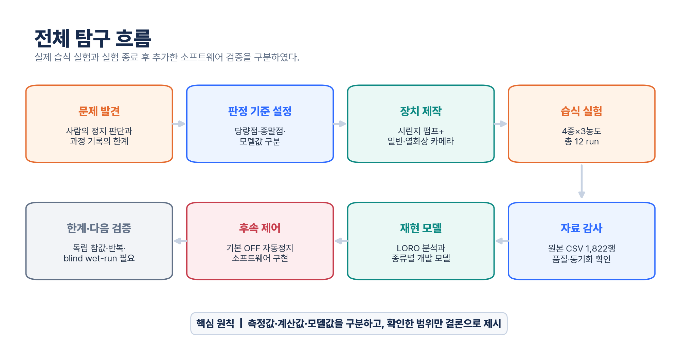

**그림 1.** 장치 제작에서 실제 적정, 자료 분석, 자동 정지 기능 구현으로 이어지는 전체 탐구 흐름.

---

# Ⅱ. 이론적 배경 및 선행 연구

## 1. 당량점과 종말점

**당량점**은 반응식의 계수비에 따라 완전히 반응한 이론적 지점이고, **종말점**은 지시약 색처럼 관찰한 지점이다. 둘은 변색 범위, 산·염기의 세기, 실제 농도와 관찰 시점에 따라 달라진다. 본 탐구는 **이론 당량점 부피**, **색·겉보기 표면온도**, 모델의 **추정 부피**를 구분하고 이론 부피와 추정 부피의 편차를 MAPE로 나타냈다.

## 2. 당량점 부피 계산

시료 농도 (C_s), 시료 부피 (V_s), 시료 반응 가수 (n_s), 적정액 농도 (C_t), 당량점까지의 적정액 부피 (V_t), 적정액 반응 가수 (n_t)는 당량점에서 다음 관계를 만족한다.

\[
C_sV_sn_s=C_tV_tn_t
\]

이론 당량점 부피는 다음과 같다.

\[
V_t=\frac{C_sV_sn_s}{C_tn_t}
\]

산과 염기는 모두 1:1로 반응한다고 두었다. 시료 부피 20.0 mL, 적정액 명목 농도 0.10 M에서 시료 농도 0.10 M, 0.15 M, 0.20 M의 이론 당량점 부피는 각각 20.0 mL, 30.0 mL, 40.0 mL이다. 모델의 추정 부피 \(\hat{V}_t\)로 미지 시료 농도를 계산하였다.

\[
\hat{C}_s=\frac{C_t\hat{V}_tn_t}{V_sn_s}
\]

모델은 센서 시계열과 실험 전에 정해지는 적정 종류로 당량점 후보를 평가하였다. 센서 입력군 비교와 최종 적정 종류 조건부 모델에서는 현재 주입량, 시료 농도, 이론 당량점 부피, 시간, 진행률, 최대 주입량과 전체 실험 길이를 입력에서 제외하였다. 현재 주입량을 넣은 초기 비교는 최종 모델에서 제외하고 참고 결과로만 보존하였다.

## 3. 비접촉 색·열화상 측정의 가능성과 한계

일반 카메라에서는 RGB·HSV 평균값을, 열화상 카메라에서는 **겉보기 표면온도**를 구하였다. 열화상은 용기 재질·반사·촬영 각도·주변 온도의 영향을 받으므로 보조 신호로 사용하고, 세 입력군의 오차로 역할을 판단하였다.

주입량은 펌프 작동 시간×설정 유량 0.99 mL/s로 계산하였다. 이론값은 약 0.962 mL/s였고 두 값의 상대 차이는 약 2.9%였으나, 반복별 토출 시간·부피 원자료가 남아 있지 않아 이 차이를 유량 정확도나 반복성으로 해석하지 않았다. 따라서 0.99 mL/s는 직접 측정 피드백이 아니라 프로그램의 부피 환산 설정값으로 다루었다.

**[표 2] 측정 신호와 해석 기준**

| 신호 | 측정·계산 내용 | 본 탐구에서의 역할 |
|---|---|---|
| 색상 | 용액 영역의 RGB·HSV 평균과 변화량 | 지시약 색 변화 관찰 |
| 열화상 | 용액·용기 영역의 겉보기 표면온도와 변화량 | 반응 과정의 보조 신호 |
| 주입량 | 펌프 작동 시간×0.99 mL/s | 변화가 나타난 부피축 구성 |
| 이론 부피 | 명목 농도·부피·반응비로 계산 | 추정 결과를 비교하는 기준 |

## 4. 선행 연구 조사

선행 연구는 여러 센서로 종말점을 찾아 펌프나 밸브를 제어하였다. 본 작품은 **색·열화상·계산 주입량을 동기화하고 네 가지 산·염기 조합을 같은 자료 구조에서 비교한 것**에 차이가 있다. 구성은 제67회 전국과학전람회 대통령상 수상작 「정색반응 분석을 위한 IAS(Image Analysis System) 제작 및 활용에 관한 탐구」의 문제 제기–장치 제작–실험 적용–오류 개선–검증 범위를 참고하였다.

**[표 3] 주요 선행 연구와 본 작품의 차이**

| 선행 연구 | 주요 방법 | 본 작품과의 차이 |
|---|---|---|
| Siqueira et al. (2017) | 웹캠 영상을 이용한 색 변화 곡선과 밸브 제어 | 본 작품은 색상뿐 아니라 열화상과 계산 주입량을 함께 저장한다. |
| Tan et al. (2020) | USB 카메라의 RGB 임계값과 시린지 펌프를 이용한 자동 정지 | 본 작품은 네 가지 산·염기 적정을 비교하고, 두 영상 신호를 시간·부피축에 결합한다. |
| Alessio et al. (2020) | 비접촉 적외선 온도센서와 자작 시린지 펌프를 이용한 열적정 | 본 작품은 한 점의 온도 대신 열화상 영역을 기록하고 가시광 색 정보와 함께 분석한다. |
| del Castillo-Santaella et al. (2023) | Arduino 펌프와 pH 미터를 결합한 저비용 자동 적정기 | 본 작품은 pH 전극 대신 색상·열화상 영상을 기록하는 방식이다. |
| Olbemo et al. (2025) | 디지털 영상의 RGB·색조를 이용한 산·염기 종말점 검출 | 본 작품은 시린지 펌프의 계산 주입량과 열화상 자료까지 같은 CSV에 남긴다. |

---

# Ⅲ. 탐구 과정 및 결과
## 1. 사전 탐구: 무엇을 어떻게 측정할 것인가

### 가. 탐구 질문

이론 당량점, 지시약의 색 변화, 열화상 변화, 계산 주입량과 모델 추정값을 어떤 기준으로 구분하고 기록할 것인가?

### 나. 탐구 방법

기록값을 계산값·관찰값·추정값으로 구분하였다. 이론 당량점 부피는 명목 농도로 계산한 비교 기준, 색 변화는 종말점 관찰값, 열화상 변화는 겉보기 표면온도 변화로 정하고, 펌프 주입량은 작동 시간과 설정 유량으로 계산하였다.

### 다. 탐구 결과

1. 이론 당량점 부피는 명목 농도로 계산한 20.0, 30.0, 40.0 mL로 정하였다.
2. 색 변화는 지시약 종말점을 찾는 주요 관찰값으로 사용하였다.
3. 열화상은 용액 내부의 정확한 온도나 당량점 참값이 아니라 보조 관찰값으로 사용하였다.
4. 주입량은 실측 부피가 아니라 펌프 작동 시간으로 계산한 값으로 기록하였다.
5. 독립 장비로 측정한 실제 당량점이 없으므로 모델 결과는 이론 부피와의 편차로만 비교하였다.

### 라. 소결론

계산값·관찰값·추정값을 구분하여 앱 화면과 CSV 항목을 설계하고 모델 성능의 평가 기준을 정하였다.

## 2. 기본 탐구 1: 비접촉 스마트 적정기 제작

### 가. 탐구 질문

직접 만든 펌프, 일반 카메라와 열화상 카메라를 한 프로그램에서 함께 구동할 수 있는가?

### 나. 시린지 펌프 제작

100 mL 주사기를 고정하고 스테퍼 모터와 T8 리드스크류로 푸셔 블록이 피스톤을 미는 구조를 제작하였다. 기울어짐을 막는 가이드 레일을 설치하고, 실험 전 호스를 물로 채워 기포를 제거하였다.

자격루에서 얻은 아이디어를 모터의 일정한 회전과 작동 시간으로 주입량을 계산하는 방식에 적용하였다. 마찰·기포·주사기 치수는 실제 토출량에 영향을 주는 별도 요인으로 다루었다.

**[표 4] 비접촉 스마트 적정기의 구성**

| 구성 요소 | 역할 |
|---|---|
| Arduino Uno·A4988 | 스테퍼 모터의 방향과 작동 제어 |
| 스테퍼 모터·T8 리드스크류 | 회전 운동을 피스톤의 직선 운동으로 변환 |
| 100 mL 주사기·호스 | 적정액 저장과 주입 |
| 일반 카메라 | 지시약 색 변화 촬영 |
| HIKMICRO Mini2 | 용액·용기 영역의 열화상 변화 촬영 |
| Windows 프로그램 | 실험 조건 입력, 펌프 제어, 영상 확인, CSV 저장 |

**그림 2.** 제작한 100 mL 시린지 펌프(위)와 실제 산·염기 적정 장치(아래).

### 다. Windows 앱 개발 과정

기본 수집기를 예비 시험과 12회 적정에 적용하며 분석 영역, 열화상 변환, 시각 대응, 표시값 구분과 저장 순서의 오류를 확인·수정하였다. 개발자료 수집 뒤에는 자동 정지 기능을 추가하고, 25 fps로 들어오는 프레임을 CSV에 순서대로 보존하는 저장 구조로 개선하였다.

**1) 실제 실험 순서에서 필요한 기능 정리**

적정 중에는 교반·색 관찰·펌프·기록을 함께 조작해야 하므로 여러 화면의 시각과 값을 맞추기 어려웠다. 이에 두 카메라 표시, 실험 조건 입력, 펌프 제어와 색·열화상·주입량의 시간축 저장 기능을 한 앱에 모았다.

**2) 수집기와 대시보드로 역할 나누기**

앱은 카메라·Arduino와 통신하며 CSV를 작성하는 Python 수집기와, 영상·분석 영역·펌프·기록 상태를 조작하는 대시보드로 나누었다.

**3) 일반 카메라의 색 분석과 분석 영역 설정**

화면 전체 평균색에는 책상·조명 반사·실험자의 손이 섞였다. 용액 부분을 사각형으로 지정하여 RGB 평균, HSV의 색조·채도·명도와 시점별 변화량을 계산하였다. 투명 비커의 자동 검출이 불안정하여 실제 12회 적정에서는 일반 영상과 열화상 영상의 영역을 각 화면에서 따로 지정·고정하고, 자동 탐색은 설정 보조로 제한하였다.

**4) Mini2 열화상 자료를 온도값으로 바꾸기**

Mini2의 원시값은 단순 비례식이나 파일별 대응표로 공통 변환할 수 없었다. HIKMICRO 공식 처리 라이브러리와 호환되는 Windows 노트북을 주 실행 환경으로 정하고, 공식 처리 결과로 섭씨 행렬을 만들었다. 분석 영역의 평균·최고·최저값, 온도 분포와 시점별 변화량을 계산하되, 용액 내부 온도가 아닌 용액·용기 영역의 겉보기 표면온도로 기록하였다.

**5) 펌프 제어와 기록 시작·종료 연결**

Arduino 펌웨어의 `a`는 후퇴, `b`는 주입, `c`는 정지 명령이며 기록 시작·종료와 주입·정지를 연결하였다. 실제 토출 부피의 피드백이 없어 작동 시간에 설정 유량 0.99 mL/s를 곱한 값을 계산 주입량으로 표시하고, 펌프 연결·명령·기록 상태를 구분하였다.

**6) 화학 계산과 CSV 구조 추가**

적정 종류, 시료·적정액, 명목 농도, 시료 부피와 지시약을 모든 측정 행에 저장하고 이론 당량점 부피, 해리상수 후보와 지시약 변색 범위를 확인하도록 하였다. CSV에는 기록 시각, 펌프 상태, 계산 주입량, 색상값, 열화상 값, 분석 영역 상태와 두 카메라의 시각 차이를 기록하였다. 최종 모델 입력에서는 현재 주입량, 시료 농도, 이론 당량점, 시간, 진행률, 최대 주입량과 전체 실험 길이를 제외하였다.

**7) 두 카메라의 시각 맞추기**

촬영 간격이 다른 두 카메라를 노트북의 공통 시계로 기록하고, 열화상과 가장 가까운 일반 영상을 짝지어 시각 차이를 CSV에 저장하였다. 실제 12회 자료 1,822행의 평균 절대 시각 차이는 3.66 ms였으며 1,821행은 양호, 1행은 경고였다.

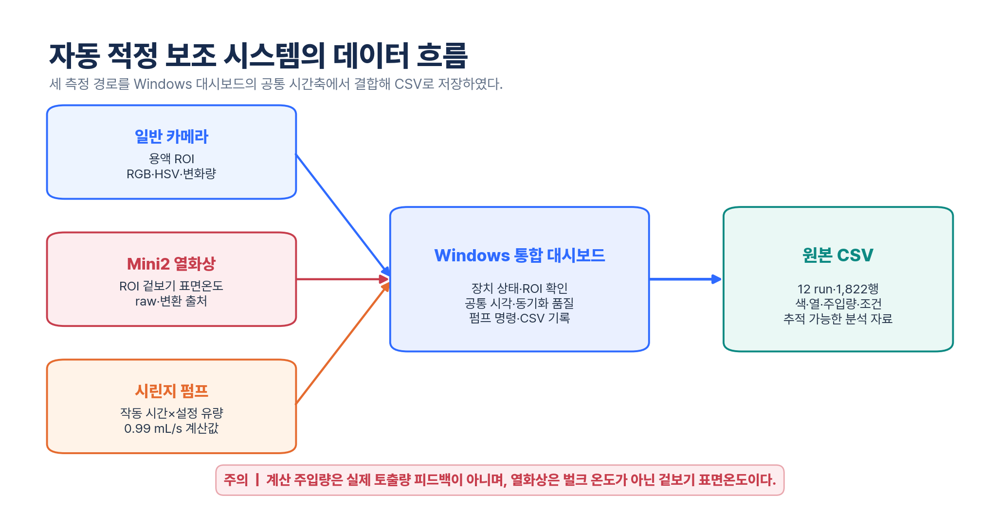

**그림 3.** 펌프·일반 카메라·열화상 카메라의 측정값을 공통 시간축에 연결하여 CSV로 저장하는 과정.

**8) 실제 사용 뒤 보완한 부분**

12회 적정 당시 원본 CSV 저장 속도는 약 3.10~4.60행/s였다. 이후 미리보기·분석과 CSV 기록의 처리 흐름을 분리하고, 25 fps로 들어오는 프레임을 기록 전용 대기열에 순서대로 넣도록 수정하였다. 기록을 종료할 때도 대기열에 남은 프레임을 모두 저장한 뒤 파일을 확정하게 하였다. 시험에서는 0.04초 간격으로 입력한 10개 프레임이 0.4초 동안 모두 기록되어 CSV 저장 속도가 25.0행/s로 집계되었고, 연속 프레임의 순서 보존과 누락 없음도 확인하였다.

**[표 5] 앱 개발 중 발견한 문제와 개선 과정**

| 관찰된 문제 | 원인 | 개선한 내용 | 다시 확인한 결과 |
|---|---|---|---|
| 배경·손·조명까지 색 변화로 기록됨 | 화면 전체 평균을 사용함 | 용액 부분만 직접 지정하고 고정하는 분석 영역 기능 추가 | 실제 12회 실험에서 일반·열화상 영역을 각각 고정해 저장 |
| 투명 비커 자동 검출이 불안정함 | 비커 경계와 배경의 대비가 낮음 | 수동 사각형 영역을 기본으로 하고 자동 탐색은 설정 보조로 제한 | 자동 검출 실패가 실험 기록을 막지 않도록 수동 경로 유지 |
| 두 카메라의 값이 같은 시각인지 알기 어려움 | 장치별 촬영 간격이 다름 | 공통 PC 시각, 각 영상 시각과 시간 차이를 CSV에 기록 | 1,822행의 평균 절대 시간 차이 3.66 ms, 경고 1행 확인 |
| 열화상 원시값의 온도 변환이 일정하지 않음 | 단순 비례식이 모든 촬영 조건에 맞지 않음 | 제조사 공식 처리 경로로 섭씨 행렬을 만들고 변환 출처 저장 | 공식 경로의 섭씨값과 변환 상태 저장 |
| 펌프 동작과 기록 상태를 혼동할 수 있음 | 장치 제어와 파일 기록이 별도 상태임 | 시작·종료를 연결하고 펌프 명령 상태와 CSV 상태를 각각 표시 | 펌프 연결·명령·기록 상태를 화면과 저장 자료에서 구분 |
| 예측값이 이론값과 지나치게 같아 보임 | 계산값과 추정값이 함께 표시되고, 이전 모델에는 정답성 입력이 포함될 수 있었음 | 표시를 분리하고 농도·이론 부피·정답까지 거리·진행률 입력을 차단 | 누수 입력이 없는 모델만 실시간 경로에서 허용 |
| 미리보기 처리 때문에 기록이 늦어질 수 있음 | 화면 표시와 순차 저장이 같은 처리 흐름을 사용함 | 미리보기·분석과 CSV 기록 경로를 분리하고 종료 시 남은 프레임까지 저장 | 25 fps 입력을 25.0행/s로 기록하고 프레임 순서와 누락 없음을 시험으로 확인 |

### 라. 앱 개발 결과

앱은 두 카메라의 지정 영역, 실험 조건, 펌프 상태와 CSV 저장 상태를 한 화면에 표시하고 세 측정값을 같은 시간축에 저장하였다. 실제 12회 적정에서는 일반 영상 31×46 px, 열화상 33×43 px의 영역을 고정·잠금하여 1,822행을 수집하였다. 이후 CSV 저장부는 25 fps 입력을 초당 25행으로 기록하고, 종료 시 남은 프레임까지 처리하도록 개선하였다.

### 마. 소결론

일반 카메라, Mini2와 시린지 펌프를 하나의 기록 흐름으로 연결하여 적정 전 과정의 시간축 자료를 확보하였다.

## 3. 기본 탐구 2: 네 가지 적정 실험과 자료 수집

### 가. 탐구 질문

산과 염기의 세기 및 농도가 달라져도 시스템이 색·열화상·주입량을 함께 기록할 수 있는가?

### 나. 실험 설계

강산-강염기, 강산-약염기, 약산-강염기, 약산-약염기의 네 종류에서 시료 농도를 0.10 M, 0.15 M, 0.20 M로 바꾸어 총 12회 실험하였다. 시료 부피는 20.0 mL, 적정액의 명목 농도는 0.10 M였다.

모델 개발에는 조합별 원본 CSV 1개씩 총 12개를 사용하였다. 세 농도는 제조 시 기록한 명목값이며 각 조합은 한 번씩만 측정되어, 이 자료만으로 반복성이나 재현성을 계산하지 않았다.

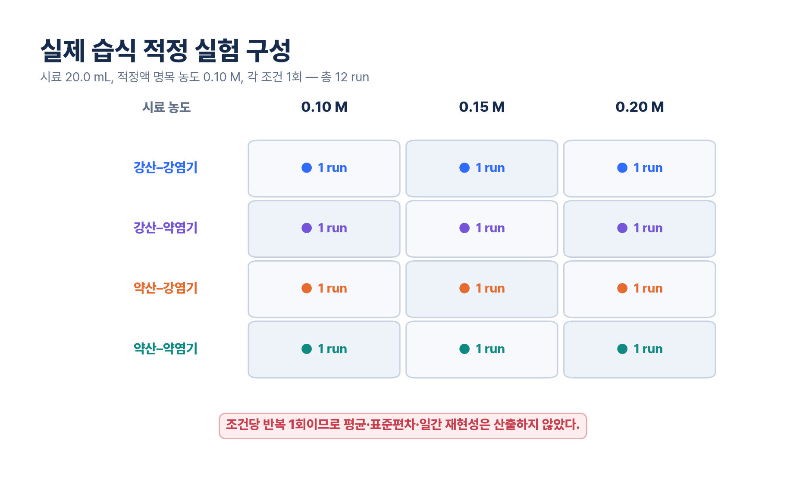

**그림 4.** 네 적정 종류와 세 농도를 조합한 12회 실험 구성.

**[표 6] 산·염기 적정 실험 조건**

| 적정 종류 | 시료 | 적정액 | 시료 농도 | 지시약 | 반복 |
|---|---|---|---|---|---:|
| 강산-강염기 | 염산 | 수산화나트륨 | 0.10, 0.15, 0.20 M | 페놀프탈레인 | 조건별 1회 |
| 강산-약염기 | 염산 | 암모니아수 | 0.10, 0.15, 0.20 M | 메틸오렌지 | 조건별 1회 |
| 약산-강염기 | 아세트산 | 수산화나트륨 | 0.10, 0.15, 0.20 M | 페놀프탈레인 | 조건별 1회 |
| 약산-약염기 | 아세트산 | 암모니아수 | 0.10, 0.15, 0.20 M | BTB¹ | 조건별 1회 |

¹ 연구 수행자의 사후 확인은 BTB이나 원본 CSV에는 메틸오렌지로 기록되어 있고 당시 1차 기록을 찾지 못했다. 원본 CSV는 수정하지 않았으며, BTB는 독립 검증되지 않은 사후 정정으로 표시하였다.

약산-약염기도 같은 방식으로 기록하여 완만한 pH 변화에 따른 지시약 종말점과 당량점의 차이를 살펴보았다.

### 다. 실험 방법

1. 시료 20.0 mL와 지시약을 비커에 넣고 교반하였다.
2. 주사기와 호스에 적정액을 채운 뒤 기포를 제거하였다.
3. 일반 카메라와 열화상 카메라를 고정하고 용액 영역을 지정하였다.
4. 프로그램에 적정 종류, 시료와 적정액, 농도, 부피와 지시약을 입력하였다.
5. 자료 기록과 펌프 주입을 시작하였다.
6. 실험자가 용액과 화면을 관찰하여 펌프를 정지하였다.
7. 원본 CSV를 보존하고 별도 분석에서 센서 변화와 당량점 부피를 살펴보았다.

12회 실험의 최종 정지는 사람이 담당했으며, 자동 정지는 자료 수집 뒤 구현하였다.

### 라. 수집 결과

2026년 6월 1일에 네 적정 종류와 세 농도를 조합한 **12회 실험**을 조건별 1회씩 수행하여 **1,822개의 시간축 측정 행**을 저장하였다. 이론 당량점 부피는 20.0, 30.0, 40.0 mL였다.

**그림 5.** 적정 종류와 농도별 실험 수 및 전체 저장 행 수.

12회 모두 색상·열화상·계산 주입량을 저장하였다. 열화상 값은 제조사 공식 처리 경로의 섭씨값이며, 두 실험의 총 11행에서 영역 평균 0.0이 나타나 수집 이상 가능 자료로 구분하였다.

**그림 6.** 주입량에 따른 12회 실험의 정규화 색조와 열화상 변화. 점선은 명목 농도로 계산한 이론 당량점이다.

그림 6은 각 실험의 신호를 0~1로 정규화한 것으로, 높이를 실제 온도나 중화열의 크기로 비교할 수 없다. 적정 종류와 농도에 따라 곡선 모양이 달라 한 가지 고정 임계값으로 모든 조건을 판정하기 어려웠다.

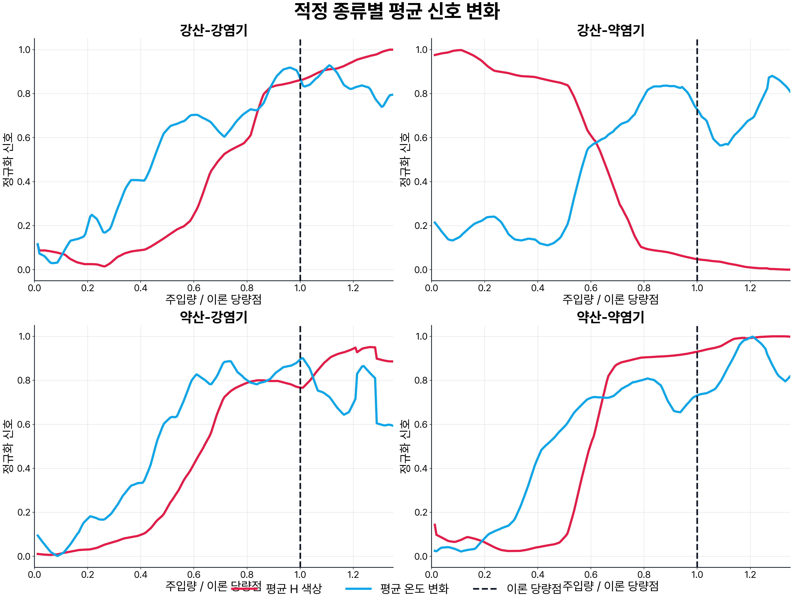

**그림 7.** 적정 종류별로 세 농도의 신호를 평균한 정규화 색조·열화상 변화. 점선은 명목 농도로 계산한 이론 당량점이다.

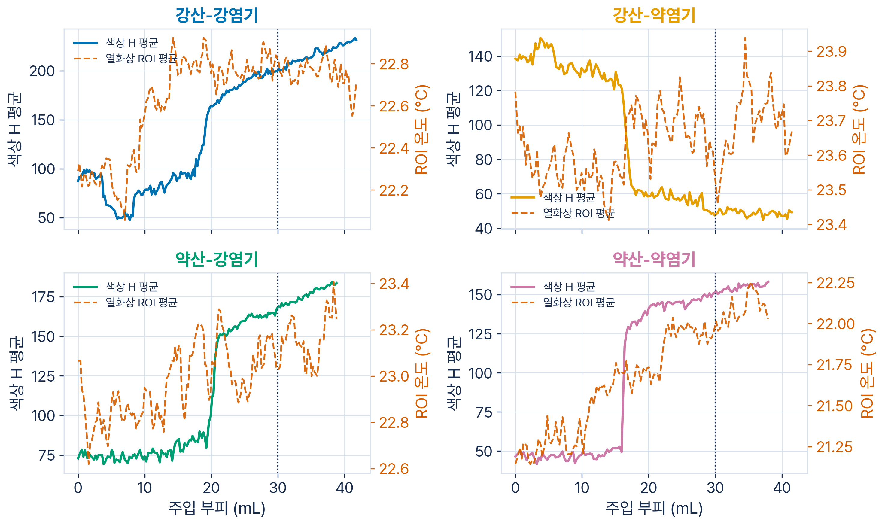

**그림 8.** 각 적정 종류의 0.15 M 대표 실험에서 기록한 색조와 겉보기 표면온도 변화.

종류별 평균 곡선과 대표 실험 곡선을 함께 보면 색 변화가 비교적 뚜렷한 조건과 열화상 변동이 큰 조건이 서로 달랐다. 따라서 한 센서의 고정 임계값보다 여러 특징을 함께 비교하는 분석이 필요하다고 판단하였다.

### 마. 소결론

12개 시간축 자료는 반응계별 신호와 기록 가능성을 비교하는 개발자료로 사용하였다. 각 종류·농도 조건이 한 번씩만 측정되어 반복성이나 재현성을 정량화할 수 없으므로, 이는 후속 습식 반복시험 항목으로 남겼다.
## 4. 심화 탐구 1: 머신러닝을 이용한 당량점 부피와 미지 농도 추정

### 가. 탐구 질문

비접촉으로 얻은 색과 열화상 특징만으로 당량점에 가까운 구간을 찾을 수 있는가? 머신러닝은 단순한 색 변화 또는 색·온도 임계값보다 당량점 부피 오차를 줄이는가? 또한 색상, 열화상, 두 신호의 융합 가운데 어떤 입력이 가장 효과적인가?

### 나. 분석 방법

분석 단위는 연속 프레임이 아니라 **CSV 한 파일에 해당하는 습식 실험 한 회**로 정하였다. 색상과 열화상 시계열에서 여러 시간 폭의 변화 후보를 만든 뒤, 실험 전에 알고 있는 적정 종류에 따라 후보 평가기를 선택하여 실험별 당량점 부피 하나를 산출하였다. 입력은 색상·열화상 센서 특징과 적정 종류뿐이며, 현재 주입량, 시료 농도, 이론 당량점, 시간, 진행률, 최종 주입량, 전체 실험 길이와 지시약은 최종 모델 입력에서 제외하였다.

평가 실험 하나를 후보 평가기의 학습과 스케일링에서 제외하는 outer leave-one-run-out 방식을 사용하였다. 초기 공통 회귀 실험에서는 Ridge, KNN, Random Forest, Extra Trees를 같은 특징 구성에서 비교하였다. 이후 센서 변화 후보를 직접 평가하는 단계에서는 PLS, 선형 판별분석(LDA), 이차 판별분석(QDA), prototype, pairwise ridge, RBF 커널 릿지, 2차 커널 릿지, RBF SVR의 여덟 알고리즘 계열과 후보 점수의 정규화·집계 방법을 탐색하였다. 초기 공통 회귀와 최종 후보 평가 방식은 특징 표현과 탐색 범위가 다르므로 두 단계의 오차를 같은 조건의 순위처럼 직접 비교하지 않았다. 최종적으로 강산-강염기는 PLS, 강산-약염기는 RBF 커널 릿지, 약산-강염기는 LDA, 약산-약염기는 QDA가 선택되었다.

다만 후보 생성과 최종 설정 선택에는 같은 12회 자료의 정답이 사용되었다. 초기 1,006,020개와 추가 1,024,350개를 합친 **2,030,370개 설정**을 같은 자료에서 비교했고, 선택 결과의 MAPE가 후보 오라클과 같았다. 따라서 아래 결과는 평가 실험을 평가기 학습에서 제외한 값이지만, 설정 선택 편향이 남아 있는 **사후 개발자료 결과**이다. 새로 조제한 미지 시료에서 확인한 독립 정확도가 아니다.

센서 자체의 기여도는 현재 주입량을 제외한 색상 전용, 열화상 전용, 색상+열화상 모델을 별도로 비교하였다. 또한 같은 12개 CSV에 색 최대 기울기와 색·온도 임계값 규칙을 적용하였다. 수동 적정 기록은 최종 원자료 파일의 12개 값을 재계산하되, 자동 방식과 판독법·검증 구조가 달라 참고 비교로만 사용하였다.

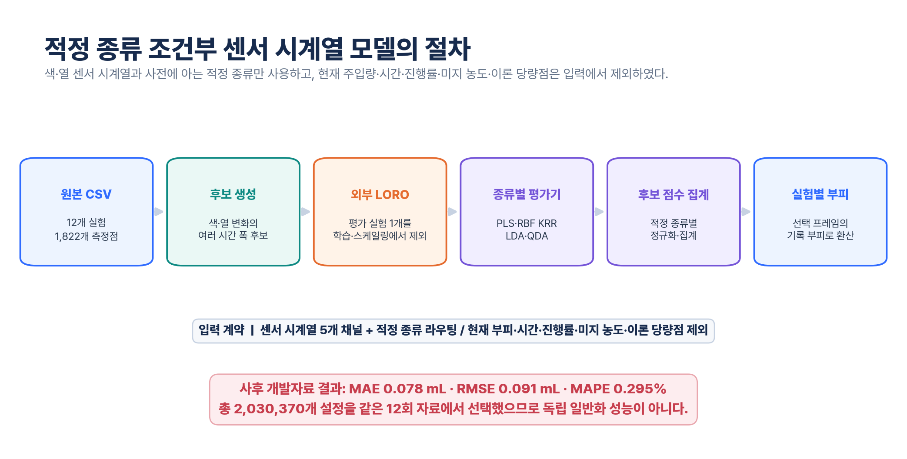

**그림 9.** 색상·열화상 시계열에서 후보를 만들고, 적정 종류별 평가기로 실험별 당량점 부피 하나를 정하는 과정.

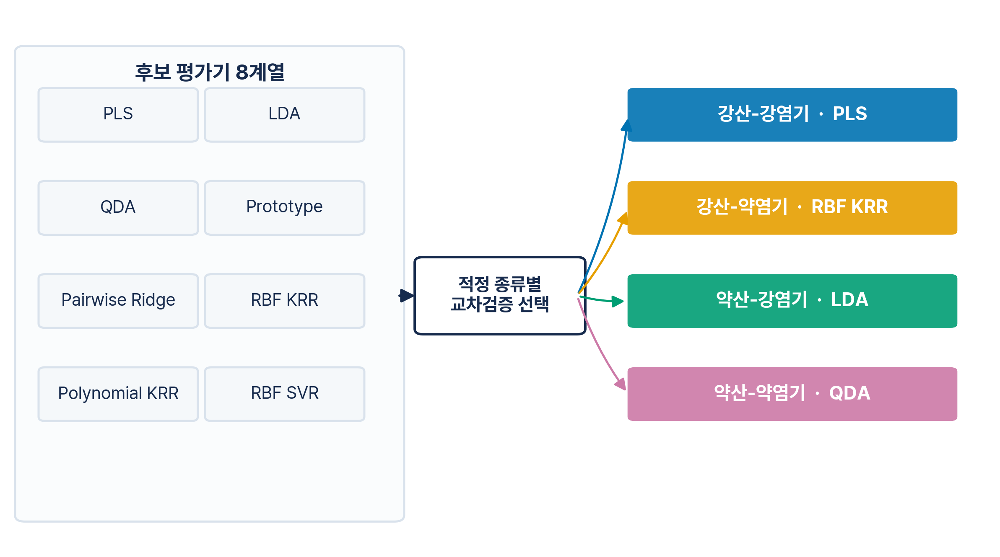

**그림 10.** 후보 평가 단계에서 탐색한 여덟 알고리즘 계열과 적정 종류별 최종 선택 결과. 이 그림은 탐색 범위를 보여주며 서로 다른 계열의 전체 MAPE 순위를 뜻하지 않는다.

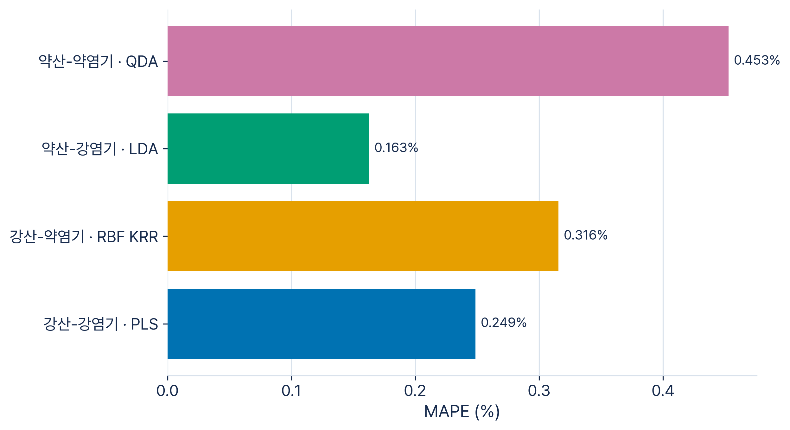

**그림 11.** 네 적정 종류에서 선택된 평가기와 종류별 개발자료 MAPE. 종류마다 신호 변화 형태가 달라 서로 다른 평가기가 선택되었다.

평가에는 평균 절대편차(MAE), 평균 제곱근편차(RMSE), 평균 절대백분율편차(MAPE)를 사용하였다.

\[
MAE=\frac{1}{N}\sum_{i=1}^{N}|V_i-\hat{V}_i|
\]

\[
RMSE=\sqrt{\frac{1}{N}\sum_{i=1}^{N}(V_i-\hat{V}_i)^2}
\]

\[
MAPE=\frac{100}{N}\sum_{i=1}^{N}\left|\frac{V_i-\hat{V}_i}{V_i}\right|
\]

여기서 \(V_i\)는 이론 당량점 부피, \(\hat{V}_i\)는 모델의 추정 부피이다.

### 다. 분석 결과

적정 종류 조건부 센서 시계열 모델의 전체 MAE는 **0.078 mL**, RMSE는 **0.091 mL**, MAPE는 **0.30%**였다. 12회 모두 절대백분율편차 1% 이내였고, 최대 절대편차는 0.156 mL였다. 난수를 사용하지 않는 평가기이므로 세 지정 seed에서 같은 결과가 나왔으며, 이는 결정론적 재실행 확인이지 독립 검증이나 seed 강건성의 증거는 아니다.

**[표 7] 적정 종류 조건부 센서 시계열 모델의 종류별 개발자료 결과**

| 적정 종류 | 선택 평가기 | MAE | RMSE | MAPE |
|---|---|---:|---:|---:|
| 강산-강염기 | PLS 회귀 | 0.068 mL | 0.073 mL | 0.25% |
| 강산-약염기 | RBF 커널 릿지 회귀 | 0.080 mL | 0.084 mL | 0.32% |
| 약산-강염기 | 선형 판별분석 | 0.049 mL | 0.071 mL | 0.16% |
| 약산-약염기 | 이차 판별분석 | 0.113 mL | 0.125 mL | 0.45% |
| **전체** | **적정 종류별 선택** | **0.078 mL** | **0.091 mL** | **0.30%** |

**[표 8] 실험별 이론 부피와 적정 종류 조건부 센서 시계열 모델 추정 부피**

| 적정 종류 | 시료 농도 | 이론 부피 | 추정 부피 | 절대편차 | 상대편차 |
|---|---:|---:|---:|---:|---:|
| 강산-강염기 | 0.10 M | 20.00 mL | 20.060 mL | 0.060 mL | 0.30% |
| 강산-강염기 | 0.15 M | 30.00 mL | 29.898 mL | 0.102 mL | 0.34% |
| 강산-강염기 | 0.20 M | 40.00 mL | 39.957 mL | 0.043 mL | 0.11% |
| 강산-약염기 | 0.10 M | 20.00 mL | 20.114 mL | 0.114 mL | 0.57% |
| 강산-약염기 | 0.15 M | 30.00 mL | 29.924 mL | 0.076 mL | 0.25% |
| 강산-약염기 | 0.20 M | 40.00 mL | 40.049 mL | 0.049 mL | 0.12% |
| 약산-강염기 | 0.10 M | 20.00 mL | 20.007 mL | 0.007 mL | 0.04% |
| 약산-강염기 | 0.15 M | 30.00 mL | 30.121 mL | 0.121 mL | 0.40% |
| 약산-강염기 | 0.20 M | 40.00 mL | 40.019 mL | 0.019 mL | 0.05% |
| 약산-약염기 | 0.10 M | 20.00 mL | 20.156 mL | 0.156 mL | 0.78% |
| 약산-약염기 | 0.15 M | 30.00 mL | 30.145 mL | 0.145 mL | 0.48% |
| 약산-약염기 | 0.20 M | 40.00 mL | 40.038 mL | 0.038 mL | 0.10% |

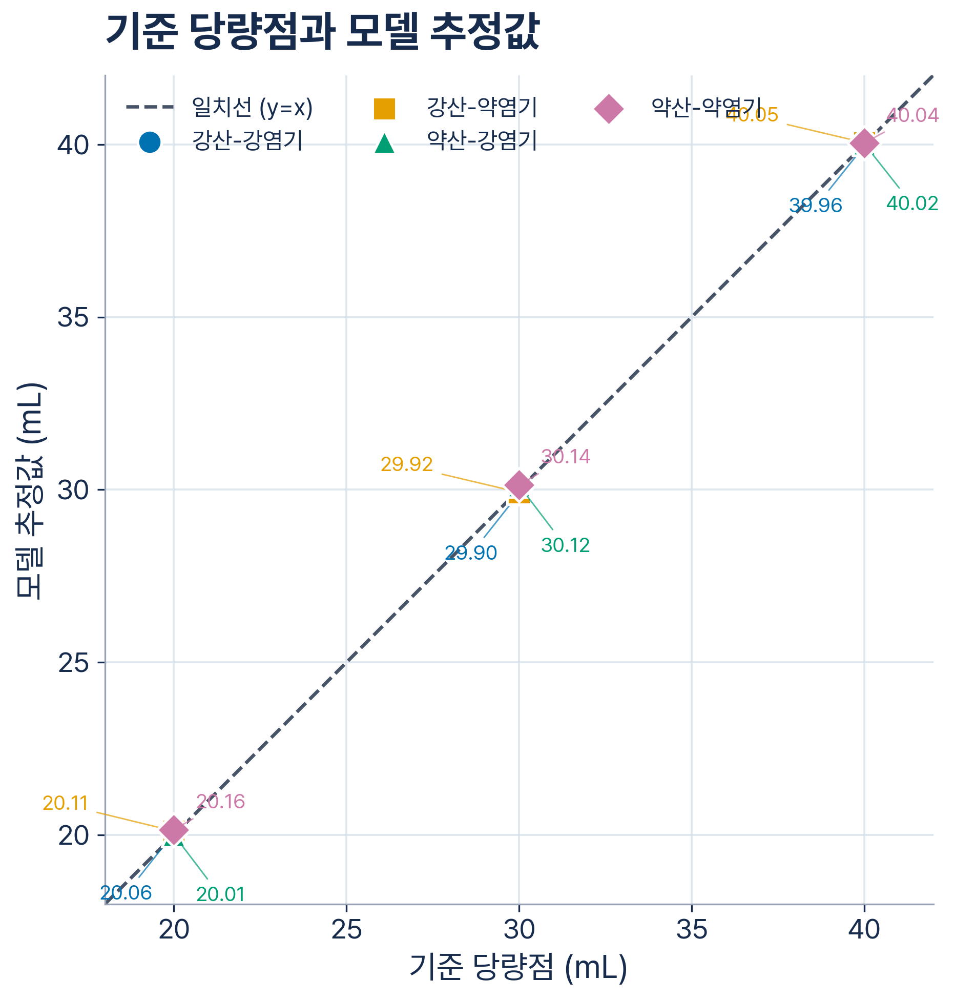

**그림 12.** 명목 농도로 계산한 이론 당량점 부피와 적정 종류 조건부 센서 시계열 모델의 사후 개발자료 추정 부피.

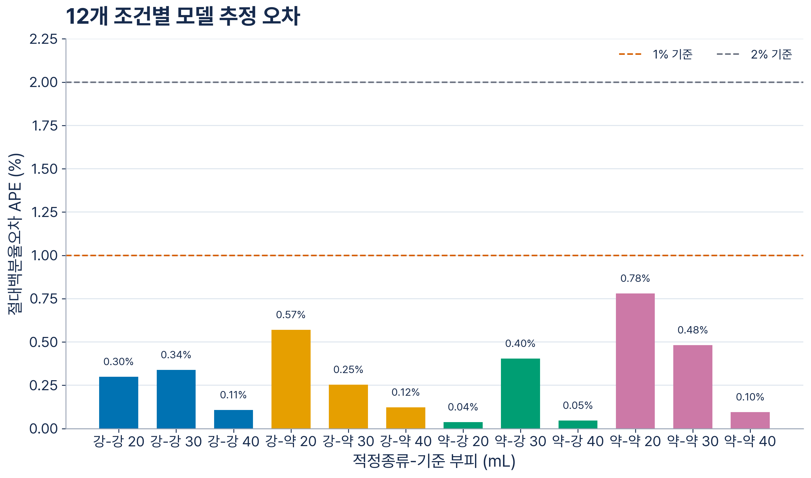

**그림 13.** 12개 조건의 이론 당량점 부피 대비 절대백분율편차. 모든 막대가 1% 아래에 있으나, 같은 자료에서 설정을 사후 선택한 결과이다.

0.30%는 같은 자료의 색 최대 기울기 4.67%와 색·온도 임계값 5.65%보다 낮았다. 그러나 대규모 설정 탐색 뒤 후보 오라클과 같은 결과가 선택되었으므로, 이 차이를 새로운 시료에서도 유지되는 향상률로 해석하지 않았다.

### 라. 이전 센서 입력군 파이프라인 비교

**[표 9] 이전 파이프라인의 머신러닝 입력 구성별 비교 결과**

| 머신러닝 입력 구성 | 적정 종류별 선택 분류기¹ | MAE | RMSE | 평균 MAPE |
|---|---|---:|---:|---:|
| 색상 | ET-L3 / LR / RF / RF | 0.548 mL | 0.754 mL | **1.55%** |
| 열화상 | ET-L3 / LR / LR / ET-L3 | 0.917 mL | 1.267 mL | **3.66%** |
| 색상+열화상 | RF / ET-L3 / RF / ET-L3 | **0.476 mL** | 0.831 mL | **1.52%** |

¹ 강산-강염기 / 강산-약염기 / 약산-강염기 / 약산-약염기 순서. RF: Random Forest, ET: Extra Trees, ET-L3: Extra Trees(최소 잎 3), LR: Logistic Regression.

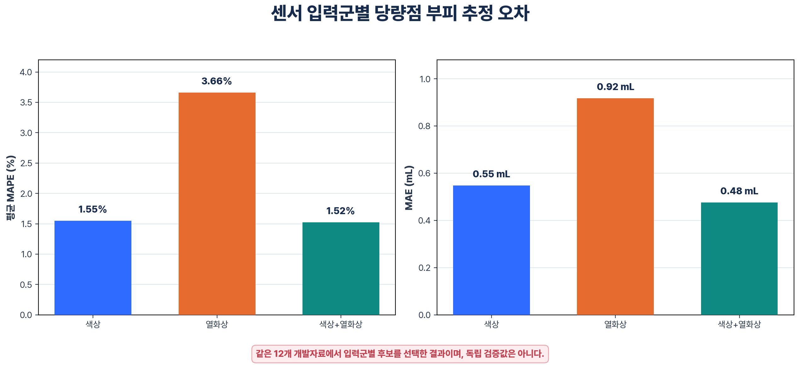

**그림 14.** 이전 센서 입력군 파이프라인에서 현재 주입량을 입력 특징에서 제외한 색상, 열화상, 색상+열화상 모델의 전체 MAPE와 MAE 비교.

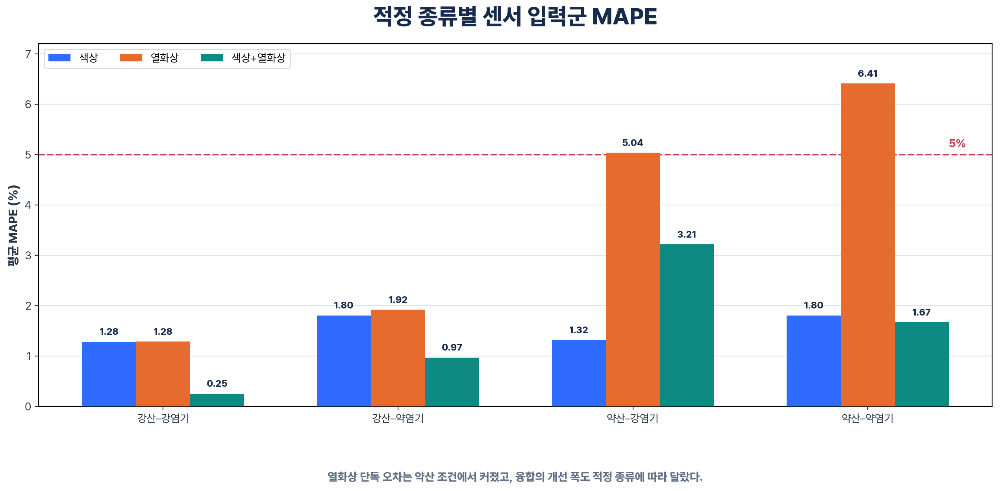

**그림 15.** 이전 센서 입력군 파이프라인의 네 적정 종류에서 색상, 열화상, 색상+열화상 입력군의 MAPE 비교.

이전 센서 입력군 파이프라인에서 색상+열화상 모델의 MAPE 1.52%는 색상 전용 1.55%보다 0.03%p 낮았지만 RMSE는 0.754 mL에서 0.831 mL로 커졌다. 선택된 융합 구성은 seed를 바꾼 점검에서도 MAPE가 크게 변했다. 따라서 센서 수를 늘리면 항상 성능이 좋아진다고 보지 않고, 열화상의 실험별 기여 방향과 이상값을 추가로 점검하였다.

이 비교도 같은 12개 자료에서 입력 구성과 모델을 고른 개발 결과이다. 새로운 용액에 대한 성능은 모델을 고정한 뒤 별도 실험으로 확인해야 한다.

### 마. 수동 적정 기록·규칙 기반 판정·머신러닝 비교

**[표 10] 제공된 수동 적정 기록과 자동 판정 방식 비교 결과**

| 판정 방식 | 판정 기준 | MAE | RMSE | 평균 MAPE | 5% 이내 |
|---|---|---:|---:|---:|---:|
| 수동 적정 제공 기록¹ | 사람이 판정한 종말점 기록 | 0.642 mL | 0.750 mL | **2.00%** | **12/12** |
| 색 최대 기울기 | 적정 종류별 색 성분의 주요 기울기 구간 | 1.183 mL | 1.736 mL | **4.67%** | 9/12 |
| 색·온도 임계값 | 색 진행도와 열 변화 점수의 지속 임계값 | 2.033 mL | 3.308 mL | **5.65%** | 7/12 |
| 머신러닝-색상(이전 파이프라인) | 색상 특징+실험 조건, ET·LR·RF | 0.548 mL | 0.754 mL | **1.55%** | **12/12** |
| 머신러닝-열화상(이전 파이프라인) | 열화상 특징+실험 조건, ET·LR | 0.917 mL | 1.267 mL | **3.66%** | **9/12** |
| 머신러닝-색상+열화상(이전 파이프라인) | 두 센서 특징+실험 조건, RF·ET | 0.476 mL | 0.831 mL | **1.52%** | **11/12** |
| 적정 종류 조건부 센서 시계열 모델 | 센서 후보+적정 종류별 PLS·KRR·LDA·QDA | **0.078 mL** | **0.091 mL** | **0.30%** | **12/12** |

¹ `data/report/manual_titration_results.csv`의 최종 제공 기록을 재계산했다. 자동 방식과 판독 시점·검증 구조가 달라 직접 우열 비교에는 사용하지 않았다.

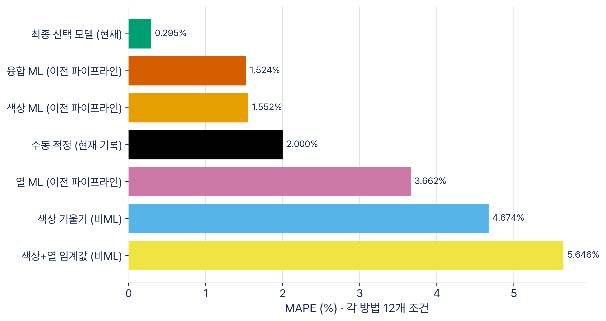

**그림 16.** 제공된 수동 기록, 두 규칙 기반 방식, 이전 파이프라인의 세 센서 입력군 모델과 현재 적정 종류 조건부 모델의 MAPE. 수동 기록은 자동 방식과 판독·검증 구조가 달라 참고값으로 표시하였다.

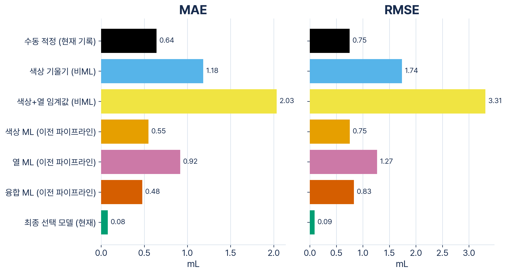

**그림 17.** 같은 판정 방식의 MAE와 RMSE 비교. 평균 오차뿐 아니라 큰 오차에 민감한 RMSE를 함께 나타냈다.

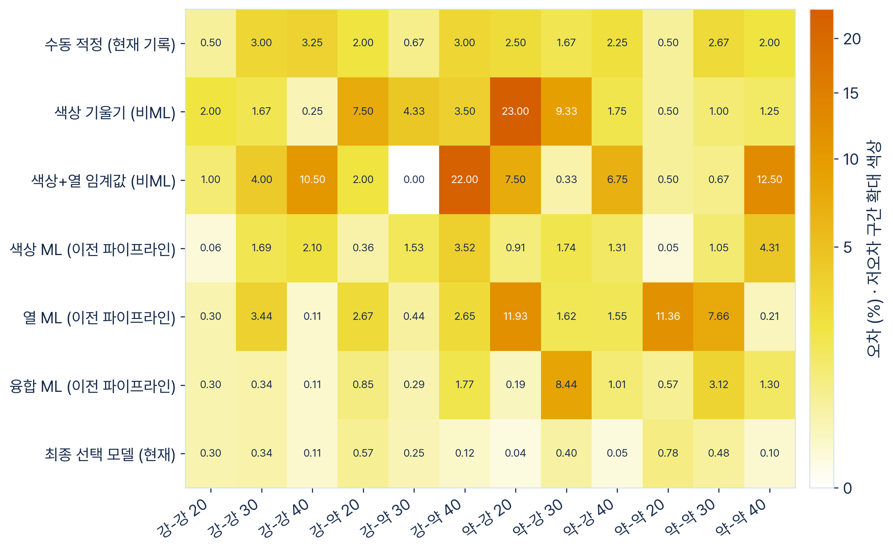

**그림 18.** 12개 실험 조건에서 판정 방식별 절대백분율편차. 평균값 하나만으로 가려지는 조건별 성공과 실패를 확인하기 위해 같은 색 범위로 나타냈다.

색 최대 기울기 방식도 적정 종류에 맞는 색 성분과 평활화 폭을 고르면 MAPE가 4.67%까지 낮아졌다. 색·온도 임계값은 5.65%로 색 기울기 방식보다 0.98%p 높았다. 열화상 변동이 임계값 통과 시점을 흔들 수 있어, 단순히 두 신호를 임계값으로 묶는 것만으로는 성능이 좋아지지 않았다.

이전 센서 입력군 파이프라인의 MAPE는 색상 1.55%, 열화상 3.66%, 색상+열화상 1.52%였다. 현재 적정 종류 조건부 센서 시계열 모델의 선택된 개발자료 MAPE는 0.30%로 두 규칙 기반 방식보다 낮았지만, 2,030,370개 설정을 같은 12회 결과에서 비교해 고른 값이다. 수동 기록의 MAPE 2.00%와도 판독법·검증 구조가 다르므로, 머신러닝이 수동 적정보다 정확하다는 근거로 사용하지 않았다.

### 바. 제공된 수동 적정 기록

다음 값은 별도로 제공받은 수동 적정 기록을 정리한 것이다. 오차율은 \((실험값-기준값)/기준값\times100\)으로 다시 계산하였다.

**[표 11] 제공된 농도별 수동 적정 기록**

| 적정 종류 | 검증 농도 | 기준 당량점 | 수동 적정 당량점 | 오차율 |
|---|---:|---:|---:|---:|
| 강산-강염기 | 0.10 M | 20.0 mL | 20.1 mL | +0.50% |
| 강산-강염기 | 0.15 M | 30.0 mL | 29.1 mL | -3.00% |
| 강산-강염기 | 0.20 M | 40.0 mL | 41.3 mL | +3.25% |
| 강산-약염기 | 0.10 M | 20.0 mL | 19.6 mL | -2.00% |
| 강산-약염기 | 0.15 M | 30.0 mL | 30.2 mL | +0.67% |
| 강산-약염기 | 0.20 M | 40.0 mL | 38.8 mL | -3.00% |
| 약산-강염기 | 0.10 M | 20.0 mL | 20.5 mL | +2.50% |
| 약산-강염기 | 0.15 M | 30.0 mL | 29.5 mL | -1.67% |
| 약산-강염기 | 0.20 M | 40.0 mL | 40.9 mL | +2.25% |
| 약산-약염기 | 0.10 M | 20.0 mL | 19.9 mL | -0.50% |
| 약산-약염기 | 0.15 M | 30.0 mL | 30.8 mL | +2.67% |
| 약산-약염기 | 0.20 M | 40.0 mL | 39.2 mL | -2.00% |
| **전체** | **12회** |  |  | **MAPE 2.00%** |

이 기록의 전체 MAE는 0.642 mL, RMSE는 0.750 mL였다. 자동 모델과 같은 시각·같은 기준으로 동시에 판독한 자료가 아니므로 제한적 참고값으로만 사용하였다.

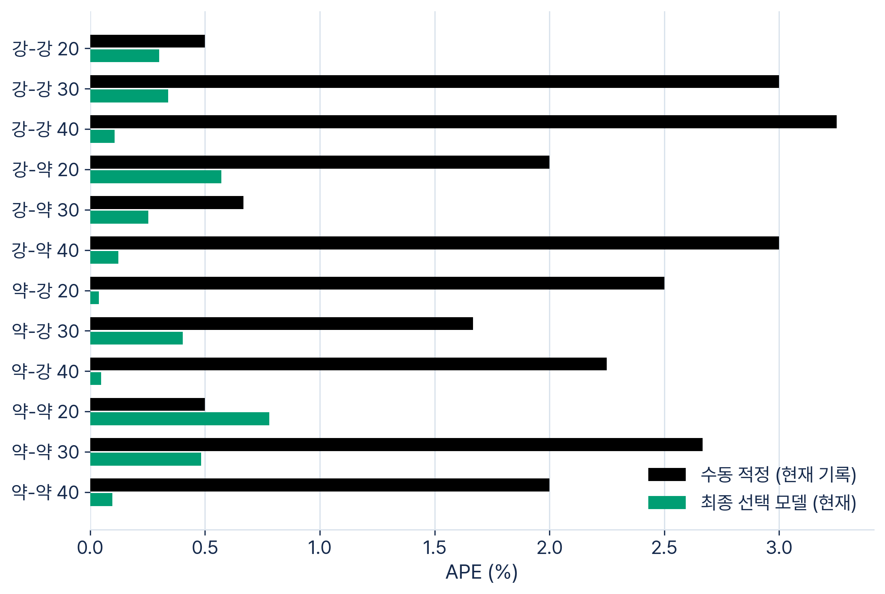

**그림 19.** 제공된 수동 적정 기록과 적정 종류 조건부 모델의 조건별 절대백분율편차. 두 자료의 판독·검증 구조가 다르므로 조건별 분포를 확인하는 참고 그림으로 사용하였다.

### 사. 미지 농도 계산과 자료 확인 절차

모델이 정한 당량점 부피 \(\hat{V}_t\)를 앞의 농도식에 대입하여 미지 농도 \(\hat{C}_s\)를 계산한다. 즉 머신러닝은 농도를 직접 맞히는 것이 아니라 당량점 부피를 찾고, 농도는 반응식으로 계산한다.

1. 표준용액을 표정하거나 독립 기준으로 실제 농도를 확인한다.
2. 평가할 시료의 농도와 이론 당량점 부피를 숨긴다.
3. CSV의 시간 순서, 주입량 증가, 분석 영역, 열화상 0값·결측과 카메라 시간 차이를 검사한다.
4. 현재 주입량, 시료 농도, 이론 부피, 정답까지의 거리와 진행률이 모델 특징에 없는지 확인한다.
5. 고정한 색상·열화상·융합 모델로 각각 당량점 부피를 추정한다.
6. 추정 부피로 농도를 계산한 뒤 독립 기준 농도와 비교한다.
7. 부피 오차와 농도 오차, 실패한 실험을 함께 기록한다.

별도로 7월에 같은 미지 시료를 사용했다고 지정한 세 실험에는 6월 개발자료에서 정한 모델과 집계 설정을 고정하여 적용하였다. 예측 농도는 0.09248, 0.09411, 0.09394 M였고 평균 0.09351 M, 표본 표준편차 0.00090 M, 변동계수 0.96%였다. 실제 농도는 표정하지 않았으므로 이 값으로 정확도나 오차율을 계산하지 않고, 같은 시료에 대한 반복성만 평가하였다.

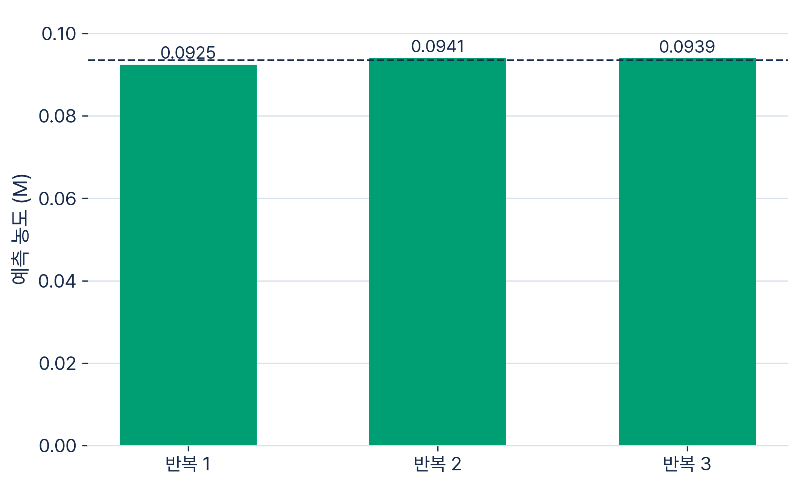

**그림 20.** 6월 설정을 고정한 모델로 계산한 동일 미지 시료 3회의 예측 농도. 점선은 세 값의 평균이다.

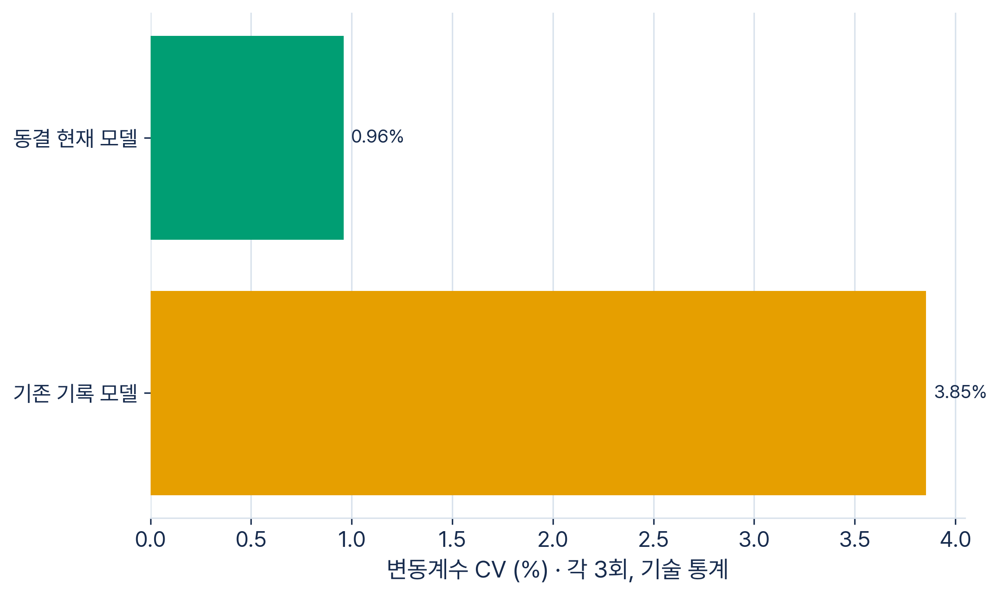

**그림 21.** 같은 세 실험에서 CSV에 기록된 기존 계산값과 6월 설정을 고정한 모델 결과의 변동계수. 이는 반복성 비교이며 실제 농도에 대한 정확도 비교가 아니다.

### 아. 열화상 기여도와 자료 품질 점검

이전 센서 입력군 파이프라인의 색상 전용과 색상·열화상 융합 모델 실험별 절대오차를 짝지어 비교하였다. 열화상 추가 뒤 오차가 감소한 실험은 7회, 증가한 실험은 5회였다. 주 추정량인 `색상 APE-융합 APE`의 평균은 0.0276%p였고, 적정 종류를 유지한 100,000회 실험 단위 bootstrap 95% 구간은 -1.2048~1.1478%p로 0을 포함하였다. 정확 양측 부호 뒤집기 검정의 p값도 0.9780이었다.

**[표 12] 색상 대비 열화상 융합의 기여도와 검증 범위**

| 확인 항목 | 결과 | 해석 |
|---|---:|---|
| 이전 파이프라인 색상 전용 개발 MAPE | 1.552% | 현재 자료의 주 센서 기준선 |
| 이전 파이프라인 열화상 전용 개발 MAPE | 3.662% | 색상 전용보다 큼 |
| 이전 파이프라인 색상+열화상 개발 MAPE | 1.524% | 색상 대비 차이 0.028%p |
| 실험별 방향 | 개선 7회·악화 5회 | 일관된 개선 아님 |
| 평균 APE 개선량 95% 구간 | -1.2048~1.1478%p | 0을 포함함 |
| 열화상 변환 0값 | 11행 | 실제 0℃가 아닌 변환 이상 가능 자료 |
| 물-물 blank·접촉 온도 기준 | 기록 없음 | 기기 S/N과 검출한계 평가 불가 |

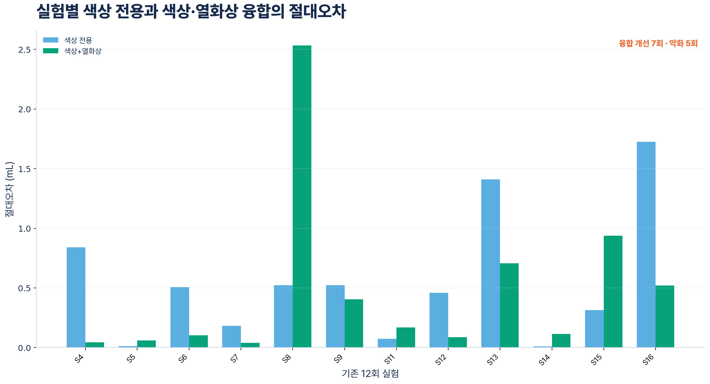

**그림 22.** 이전 센서 입력군 파이프라인의 색상 전용과 색상·열화상 융합 모델 실험별 절대오차. 연결선이 아래로 가면 융합 후 개선, 위로 가면 악화된 경우이다.

따라서 열화상은 모든 조건에서 정확도를 높이는 필수 센서가 아니라, 일부 반응계에서 색상과 다른 변화를 제공할 가능성이 있는 탐색적 보조 센서로 해석하였다. 또한 두 실험의 총 11행에서 변환된 열화상 ROI 평균이 0.0이었으나 원시값은 0이 아니어서, 실제 0℃가 아니라 변환 경로의 일시적 이상 가능성으로 분리하였다.

### 자. 소결론

같은 12회 개발자료에서 적정 종류 조건부 센서 시계열 모델의 선택된 MAPE는 0.30%였지만, 2,030,370개 설정을 같은 자료에서 사후 비교한 결과이므로 독립 정확도로 해석하지 않았다. 이전 센서 입력군 파이프라인에서 색상 전용과 색상·열화상 융합의 MAPE는 각각 1.55%와 1.52%였고, 짝지은 불확실성 구간이 0을 포함하여 열화상의 일관된 이득은 확인되지 않았다. 6월 12조건은 각 조건이 한 번뿐이어서 조건별 반복성을 평가하지 못했지만, 별도 7월 동일 미지 시료 3회에서는 고정 모델 예측 농도의 변동계수 0.96%를 확인하였다.

## 5. 심화 탐구 2: 종말점 근처 미세 주입과 선택형 자동 정지

### 가. 탐구 질문

이론 당량점 부피를 직접 정지 기준으로 사용하지 않으면서, 종말점 접근 뒤 연속 주입을 미세 주입으로 바꾸고 모델 판단과 실제 색 변화로 펌프를 정지할 수 있는가?

### 나. 구현 방법

4차 서면컨설팅에서는 연속 주입만 유지하면 종말점 부근에서 과주입될 수 있으므로 `drop-by-drop`에 가까운 제어가 필요하다는 의견이 제시되었다. 이에 실제 적정 12회를 마친 뒤 Windows 프로그램과 Arduino 펌웨어에 사용자가 선택할 때만 작동하는 미세 펄스 주입 기능을 추가하였다.

1. 녹화를 시작하되 펌프는 정지 상태로 유지하고 약 1초 동안 일반 영상 ROI의 기준색과 실시간 제어 모델 입력을 확인한다.
2. 기준색이나 필수 모델 입력을 정해진 시간 안에 확보하지 못하면 펌프를 시작하지 않고 기록을 종료한다.
3. 준비가 확인되면 펌웨어 구동시간 제한 `G <ms>`와 주입 방향 명령을 보낸다. Windows는 펌웨어가 같은 시간 한도와 방향을 응답했을 때만 연속 주입을 시작한 것으로 인정하며, 불일치하거나 필수 센서·모델 계산이 실패하면 정지 명령을 보내는 실패-폐쇄 방식으로 처리한다.
4. 실시간 제어 모델 점수가 0.20 이상이면 종말점 접근 구간으로 판단하고 `c` 명령으로 연속 주입을 멈춘 뒤 0.50초 동안 혼합을 기다린다.
5. 종말점이 아직 확인되지 않으면 Arduino에 `STEP 5` 명령을 보내 5스텝만 움직인다. 현재 장치 배선에서 주입 방향은 `b`, 되감기 방향은 `a`이므로 펌웨어의 펄스 방향도 `b`로 맞추었다. Windows는 연속 주입 방향과 펌웨어의 펄스 방향이 일치하지 않으면 자동 펄스 모드를 시작하지 않는다.
6. Windows는 `STEP ACCEPTED 5`와 `PUMP STOPPED PULSE_COMPLETE`를 모두 확인한다. 완료 응답 대기가 막혀도 별도의 비상정지 경로로 `c`를 먼저 보낼 수 있으며, 응답이 불확실하면 중복 토출을 막기 위해 자동 재전송하지 않고 정지 상태로 끝낸다.
7. 완료 응답 뒤 다시 0.50초 동안 혼합과 센서 안정화를 기다리고, 종말점이 확인되지 않으면 5~7단계를 반복한다.
8. 모델 점수가 0.30 이상일 때 시작된 ROI 색 변화가 0.4초 이상 지속되면 최종 `c` 명령을 보내고 정지 시각과 계산 주입량을 CSV에 기록한다.
9. 수동 밀기·되감기와 자동정지를 끈 일반 녹화는 `c` 정지 명령 전까지 계속 동작한다. 자동정지를 켠 경우에만 보수적 최대 유량, 비상 주입 상한 100 mL, `G <ms>` 펌웨어 제한 최대 120초와 `STEP 1~200` 범위를 적용한다. 중복 시작은 제한시간을 갱신하지 않고, 같은 녹화 세션에서 정지 후 재시작해도 앞서 계산된 주입량을 최대부피에서 차감한다. CSV 시작·종료 또는 센서 큐 정리 중에는 동시에 들어온 주입·후퇴 요청을 대기 후 실행하지 않고 거부한다.

펌웨어의 한 스텝 주기는 HIGH 5000 마이크로초와 LOW 5000 마이크로초를 합한 0.01초이므로 명목상 초당 100스텝이다. 설정 유량 0.99 mL/s를 적용하면 1스텝은 0.0099 mL, 기본 5스텝 펄스는 0.0495 mL로 환산되어 CSV 계산 주입량에 더해진다. 최대량 안전 판단에는 별도 상한 0.0105 mL/step을 적용해 펄스당 0.0525 mL를 보수적으로 예약한다. 두 값 모두 실제 한 방울 또는 실측 토출량이 아니다.

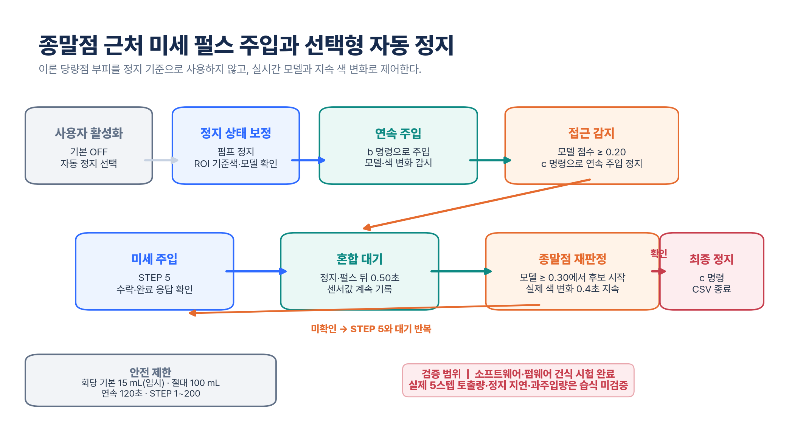

**그림 23.** 정지 상태에서 기준색과 제어 모델을 확인한 뒤 연속 주입하고, 접근 감지 후 5스텝 미세 주입·완료 응답 확인·0.50초 대기를 반복하는 과정.

### 다. 구현 결과

기존 `a`, `b`, `c` 명령을 유지하면서 `STEP 1~200` 명령을 추가하였다. 펌웨어는 요청한 스텝을 수행한 뒤 모터 드라이버를 자동 비활성화하고, Windows 프로그램은 수락과 완료 응답을 모두 확인한다. 통신 결과가 불확실한 펄스는 자동 재전송하지 않으므로 이 구조는 ‘정확히 한 번 전송’이 아니라 **중복 토출을 피하는 at-most-once 처리와 명시적 불확실성 기록**이다. 또한 응답 대기 중 비상정지 선점, 최종 취소 검사와 방향 바이트의 원자적 중재, 방향·구동시간 응답 일치, 중복 시작 차단, 녹화 세션 누적부피 한도 유지, CSV 전환과 펌프 시작의 경쟁 차단, 종료 요청의 진행 중 시작 취소, 소유 토큰과 세션 번호 래치를 이용한 자동·수동 정지 중첩 차단, 이전 세션 지연 콜백의 새 세션 간섭 차단, 필수 센서 오류의 덮어쓰기 방지를 건식 회귀시험으로 확인하였다. 부호나 공백이 섞인 안전 한도 명령도 정수 변환 전에 펌웨어에서 거부한다. 연속 구동 시간, 펄스 횟수·총 스텝 수·명목상 펄스 부피와 정지 원인은 CSV에 구분해 기록한다. 펌웨어 계약, 상태 전환, 시리얼 응답과 CSV 기록은 하드웨어 없는 단위·통합시험으로 확인했으며 Arduino Uno 대상 컴파일도 통과하였다.

자동 정지에 사용하는 실시간 분류기는 실험 전체 기록에서 부피 하나를 사후 선택한 앞 절의 0.30% 모델과 별개이다. 실제 12회 적정은 사람이 정지했으며 새 미세 주입 기능으로 반복하지 않았다. 따라서 0.0495 mL는 실측 방울 부피가 아니고, 실제 정지 부피·명령 지연·과주입량·정밀도 향상은 아직 확인하지 못하였다.

기존 12개 CSV를 시간순으로 재생한 반사실적 점검에서는 12회 모두 로드되었고 endpoint 양성 행이 있는 10회가 정책 계산에 사용되었다. 그중 0.4초 연속 양성과 가상 `STEP 5` 정책으로 정지한 자료는 1회뿐이었다. 저장된 라벨은 가상 펄스 뒤 새로 생길 혼합·센서 반응을 포함하지 않으므로, 이는 실제 자동 정지 성공률이 아니라 현재 라벨 지속성의 제한적 점검이다.

### 라. 소결론

연속 주입을 종말점 접근 뒤 5스텝 미세 주입으로 전환하고, 응답 확인·혼합 대기·센서 재판정을 반복하는 선택형 자동 정지 구조를 구현하였다. 소프트웨어와 펌웨어 수준에서는 drop-by-drop에 가까운 명령이 가능하지만, 실제 방울 부피와 정지 정확성은 습식 반복시험 전까지 검증된 성능으로 제시하지 않는다.

---
# Ⅳ. 종합 논의

## 1. 탐구를 통해 확인한 점

제작한 시린지 펌프와 일반·열화상 카메라를 산·염기 적정에서 함께 구동하여 색, 겉보기 표면온도와 계산 주입량을 하나의 CSV에 기록하였다. 여기서 ‘비접촉’은 시료 채취나 적정액 주입이 아닌 관찰 신호의 측정 방식을 뜻한다. 적정 종류마다 변화 곡선이 달라 모든 조건에 하나의 단순 임계값을 적용하기 어려웠다.

이전 센서 입력군 파이프라인의 개발자료 MAPE는 색상 1.55%, 열화상 3.66%, 색상+열화상 1.52%였다. 융합은 7회에서 색상 전용보다 오차가 줄고 5회에서 커졌으며, 평균 APE 개선량의 95% 구간은 0을 포함하였다. 따라서 열화상을 모든 적정에서 정확도를 높이는 센서로 단정하지 않고 탐색적 보조 신호로 재분류하였다.

적정 종류 조건부 센서 시계열 모델의 선택된 개발자료 결과는 MAE 0.078 mL, RMSE 0.091 mL, MAPE 0.30%였고 12회 모두 1% 이내였다. 그러나 평가 run의 정답이 평가기 학습에는 들어가지 않았더라도 최종 설정 선택에는 같은 12회 정답을 사용했고, 총 2,030,370개 설정 중 고른 결과가 후보 오라클과 일치했다. 이 때문에 0.30%는 실시간 자동정지 성능이나 새 시료 일반화 정확도가 아니라, 전체 기록을 사후 분석한 개발자료 최저값이다.

수동 제공 기록의 재계산 MAPE는 2.00%, 색 최대 기울기는 4.67%, 색·온도 임계값은 5.65%였다. 수동 기록과 모델은 판독법·검증 구조가 달라 직접 우열을 주장하지 않았다. 6월 12조건은 각 종류·농도 조합이 한 번뿐이어서 조건별 반복성과 새로운 조제 배치에 대한 일반화를 확인하지 못하였다. 다만 별도 7월 동일 미지 시료 3회에 6월 설정을 고정해 적용했을 때 예측 농도의 변동계수는 0.96%였다. 실제 농도는 표정하지 않아 정확도는 판단하지 않았다.

## 2. 핵심 성과 정리

**[표 13] 핵심 성과 정리**

| 항목 | 핵심 성과 |
|---|---|
| 장치 | 100 mL 시린지 펌프·일반 카메라·HIKMICRO Mini2·Windows 앱 통합 |
| 자료 | 네 적정 종류×세 농도, 총 12회·1,822행 기록 |
| 판정 방식 비교 | 수동 제공 기록 **2.00%**, 색 기울기 **4.67%**, 색·열 임계값 **5.65%**, 이전 파이프라인 ML 색상 **1.55%**, ML 열화상 **3.66%**, ML 융합 **1.52%**, 현재 적정 종류 조건부 모델 **0.30%** |
| 최저 개발자료 모델 | 센서 시계열+적정 종류 조건부 평가기: MAE **0.078 mL**, RMSE **0.091 mL**, MAPE **0.30%** |
| 이전 센서 입력군 파이프라인 | 색상 **1.55%**, 열화상 **3.66%**, 색상+열화상 **1.52%** |
| 최저 모델의 종류별 MAPE | 강산-강염기 **0.25%**, 강산-약염기 **0.32%**, 약산-강염기 **0.16%**, 약산-약염기 **0.45%** |
| 모델 해석 | 2,030,370개 설정을 같은 12회 자료에서 사후 선택했으므로 독립 정확도가 아님 |
| 별도 반복성 | 동일 미지 시료 3회 예측 농도 평균 **0.09351 M**, 변동계수 **0.96%**. 실제 농도 미표정으로 정확도 평가는 하지 않음 |
| 열화상 기여 | 색상 대비 개선 7회·악화 5회, 평균 APE 개선량의 95% 구간이 0 포함 |
| 자동 정지 | 5스텝 명목 0.0495 mL 펄스·응답 확인·실패-폐쇄 구조를 건식 시험함. 습식 정지 성능은 미검증 |

## 3. 연구의 한계와 개선 방법

**[표 14] 연구의 한계와 개선 방법**

| 한계 | 결과에 미칠 수 있는 영향 | 개선 방법 |
|---|---|---|
| 조건별 1회 실험 | 우연 오차와 반복성 구분 곤란 | 종류·농도별 3회 이상, 날짜를 달리해 재실험 |
| 명목 농도·이론 부피 사용 | 실제 농도·당량점과 차이 가능 | 적정액 표정, pH 전극으로 당량점 확보 |
| 시간으로 주입량 계산 | 마찰·기포·호스에 따른 토출량 차이 | 질량·부피 반복 보정, 모터 스텝 피드백 추가 |
| 조명·반사·열화상 일부 0값 | 색상·겉보기 표면온도 변동 | 조명·카메라·용기 고정, 이상값 품질 처리 |
| 같은 12회 자료에서 2,030,370개 설정 선택 | 선택된 0.30%가 새 시료에서 크게 달라질 수 있음 | 설정을 동결하고 새 조제 배치로 블라인드 반복 시험 |
| 수동 기록과 자동 모델의 판독법·검증 구조 차이 | 숫자만 직접 비교하면 우열을 과장할 수 있음 | 같은 시료·같은 기준장비로 동시 비교 |
| 6월 조건별 반복 자료 없음 | 조건별 반복성·재현성·농도별 분산 평가 불가. 7월 동일 미지 시료 3회 반복성만 별도 확인 | 표정한 용액으로 종류·농도별 3회 이상, 날짜를 달리해 측정 |
| 열화상 융합 이득 불확실·변환 0값 11행 | 일부 조건에서 오히려 오차 증가 | blank·접촉 온도 기준·결측 처리와 사전 고정 ablation 검증 |
| 미세 펄스 주입의 습식 검증 부족 | 명목상 0.0495 mL와 실제 토출량의 차이, 정지 지연·과주입량 불명 | 질량 또는 부피로 5스텝 토출량을 반복 측정하고 저위험 조건에서 최종 정지 부피 확인 |

## 4. 탐구의 의의

학교 적정에서 색과 겉보기 표면온도를 비접촉으로 측정하고 계산 주입량과 동기화하여 관찰·기록·추정·제어를 연결한 데 의의가 있다.

---

# Ⅴ. 결론 및 활용 방안

## 1. 결론

본 탐구에서는 학교 환경에서 제작한 시린지 펌프, 일반 카메라와 열화상 카메라를 하나의 기록 흐름으로 연결하고, 12회 습식 적정에서 1,822개 시계열 행을 저장하였다. 이전 센서 입력군 파이프라인에서 색상 전용과 색상·열화상 융합 모델의 개발자료 MAPE는 각각 1.55%와 1.52%로 비슷했고, 열화상 추가 후 오차는 7회 감소하고 5회 증가하여 일관된 향상을 확인하지 못하였다. 이후 구성한 현재 적정 종류 조건부 센서 시계열 모델은 현재 주입량·시간·진행률·미지 농도·이론 당량점을 입력하지 않고 MAE 0.078 mL, RMSE 0.091 mL, MAPE 0.30%를 보였다. 다만 2,030,370개 설정을 같은 12회 자료에서 사후 선택했고 후보 오라클과 일치하므로, 이 값은 새 시료의 독립 정확도가 아닌 개발자료 내부 결과이다. 별도 7월 동일 미지 시료 3회에는 6월 설정을 고정하여 적용했고 예측 농도의 변동계수는 0.96%였으나, 실제 농도를 표정하지 않아 정확도는 평가하지 않았다. 종말점 근처에서는 연속 주입을 멈추고 명목상 0.0495 mL의 5스텝 펄스와 0.50초 대기를 반복하도록 구현했지만, 실제 펄스 토출량과 습식 자동정지 정확성은 검증하지 않았다. 본 작품의 확인된 성과는 적정액 주입, 비접촉 관찰, 동기화 기록, 사후 당량점 추정과 안전한 제어 명령을 하나의 시제품으로 통합한 데 있으며, 실제 유량 반복성·표정한 용액의 조건별 반복 실험·새 시료 정확도 검증은 후속 과제로 남는다.

## 2. 활용 방안

1. **학교 적정 기록**: 색 변화 전후의 색·열화상·주입량을 다시 확인한다.
2. **지시약 비교**: 지시약별 색 변화 시점과 이론 당량점의 차이를 비교한다.
3. **센서 융합**: 같은 절차로 세 입력군의 기여도와 적용 범위를 비교한다.
4. **자동 제어 교육**: 측정·저장·머신러닝 판단·모터 제어의 연결을 학습한다.

---

# Ⅵ. 생성형 AI 활용 목적 및 범위

본 탐구에서는 생성형 AI를 프로그램 구조 검토, 코드 오류 원인 탐색, CSV 항목 점검, 분석 코드 작성 보조와 보고서 수치의 교차 확인에 활용하였다. AI의 제안은 원본 자료, 실행 결과와 실제 장치 동작을 확인한 뒤 선택적으로 사용하였다. 시린지 펌프 제작, 장치 조립, 시약 준비, 실제 적정과 원본 CSV 수집은 탐구자가 직접 수행했으며, 생성형 AI로 가상의 실험값을 만들거나 원본 측정값을 바꾸지 않았다.

**[표 15] 생성형 AI 활용 내역**

| 도구 | 모델·버전 | 활용 시기 | 활용 범위 | 주소 |
|---|---|---|---|---|
| OpenAI Codex | GPT-5.5 | 2026. 7. | 코드·자료 구조 점검, 분석 및 보고서 검토 보조 | https://openai.com/codex/ |

---

# Ⅶ. 참고문헌

1. IUPAC. “equivalence-point.” *Compendium of Chemical Terminology (Gold Book)*, 5th ed., 2025. https://doi.org/10.1351/goldbook.09042
2. IUPAC. “titration.” *Compendium of Chemical Terminology (Gold Book)*, 5th ed., 2025. https://doi.org/10.1351/goldbook.T06387
3. Siqueira, L. A., et al. “Accurate automatic titration procedure for low sharpness and dichroism in end point detection using digital movies as detection technique.” *Microchemical Journal*, 133, 593–599, 2017. https://doi.org/10.1016/j.microc.2017.04.041
4. Tan, S. W. B., Naraharisetti, P. K., Chin, S. K., & Lee, L. Y. “Simple Visual-Aided Automated Titration Using the Python Programming Language.” *Journal of Chemical Education*, 97(3), 850–854, 2020. https://doi.org/10.1021/acs.jchemed.9b00802
5. Alessio, K. O., et al. “Open source, low-cost device for thermometric titration with non-contact temperature measurement.” *Talanta*, 216, 120975, 2020. https://doi.org/10.1016/j.talanta.2020.120975
6. del Castillo-Santaella, T., Maldonado-Valderrama, J., & Fernández-Rodríguez, M. Á. “Autotitrator based on an Arduino Open Source Pump.” *HardwareX*, 15, e00464, 2023. https://doi.org/10.1016/j.ohx.2023.e00464
7. Olbemo, S. K., Sakai, Y., Takeuchi, M., & Tanaka, H. “Application of digital-movie-based flow colorimetry to hue-based end point detection of acid-base titration by feedback-based flow ratiometry using universal indicator.” *Analytical Sciences*, 41, 419–425, 2025. https://doi.org/10.1007/s44211-024-00712-6
8. Geurts, P., Ernst, D., & Wehenkel, L. “Extremely randomized trees.” *Machine Learning*, 63, 3–42, 2006. https://doi.org/10.1007/s10994-006-6226-1
9. Breiman, L. “Random Forests.” *Machine Learning*, 45, 5–32, 2001. https://doi.org/10.1023/A:1010933404324
10. HIKMICRO. *Mini Series Thermal Imager User Manual*. 2025. https://webassets.hikmicrotech.com/global/asset/88ee64bee54c4a5b83a80d31e7eefac6.pdf
11. 국립중앙과학관. “제72회 전국과학전람회 개최 요강.” 2026. https://www.science.go.kr/mps/1078/bbs/157/moveBbsNttDetail.do?nttSn=48778
12. 김도율·김연욱·정광혁. 「정색반응 분석을 위한 IAS(Image Analysis System) 제작 및 활용에 관한 탐구」. 제67회 전국과학전람회 대통령상, 2021. https://www.science.go.kr/mps/1079/bbs/423/moveBbsNttDetail.do?nttSn=29151
